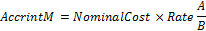

# IFinance.AccrintM

IFinance.AccrintM
-

# IFinance.AccrintM

## Синтаксис

AccrintM(Issue: DataTime; Settlement: DataTime;
Rate: Double; NominalCost: Double; [Basis: Integer = 0]): Double;

## Параметры

Issue. Дата выпуска ценных
 бумаг. Должен быть меньше Settlement;

Settlement. Дата расчета за
 ценные бумаги. Должен быть больше Issue;

Rate. Годовая процентная ставка
 для купонов по ценным бумагам. Должен быть положительным;

NominalCost. Номинальная стоимость
 ценных бумаг. Должен быть положительным;

Basis. Используемый способ
 вычисления дня. Задается в интервале от 0 до 4:

	- 0. Способ вычисления
	 дня американский/360 дней (метод NSAD). Значение по умолчанию;

	- 1. Способ вычисления
	 дня Фактический/фактический;

	- 2. Способ вычисления
	 дня Фактический/360 дней;

	- 3. Способ вычисления
	 дня Фактический/365 дней;

	- 4. Способ вычисления
	 дня европейский 30/360 дней.

Необязательный параметр.

## Описание

Метод AccrintM возвращает накопленный
 процент по ценным бумагам, процент по которым выплачивается в срок погашения.

## Комментарии

AccrintM вычисляется следующим
 образом:

,

где:

	- A. Число накопленных
	 дней в соответствии с месячным базисом. Для вычисления дохода на дату
	 погашения используется число дней между датой выпуска и сроком погашения;

	- B. Количество дней
	 в году в зависимости от базиса.

## Пример

Добавьте ссылку на системную сборку MathFin.

					Sub UserProc;

		Var

		    r: Double;

		Begin

		    r := Finance.AccrintM(DateTime.ComposeDay(2008,01,12), DateTime.ComposeDay(2008,06,13), 11, 100, 3);

		    Debug.WriteLine(r);

		End Sub UserProc;

В результате выполнения примера в окно консоли будет выведена величина
 накопленного процента, равная 461.096.

См. также:

[IFinance](IFinance.htm)

		Справочная
		 система на версию 10.9
		 от 18/08/2025,
		 © ООО «ФОРСАЙТ»,
