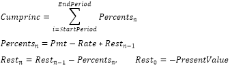

# IFinance.Cumprinc

IFinance.Cumprinc
-

# IFinance.Cumprinc

## Синтаксис

Cumprinc(Rate: Double;

PeriodCount: Integer;

PresentValue: Double;

StartPeriod: Integer;

EndPeriod: Integer;

Type: Integer): Double;

## Параметры

		 Параметры
		 Описание
		 Ограничения

		 Rate
		 Процентная ставка.
		 Должен быть положительным.

		 PeriodCount
		 Общее количество периодов выплат.
		 Должен быть положительным.

		 PresentValue
		 Стоимость инвестиций на текущий момент.
		 Должен быть положительным.

		 StartPeriod
		 Номер первого периода, включаемого в вычисления. Периоды выплат
		 нумеруются начиная с 1.
		 Должен принадлежать промежутку [1, PeriodCount].

		 EndPeriod
		 Номер последнего периода, включаемого в вычисления.
		 Должен принадлежать промежутку [StartPeriod, PeriodCount].

		 Type
		 Выбор времени платежа:

0 - В конце периода;

1 - В начале периода.
		 Должен принимать значение 0 или 1.

## Описание

Метод Cumprinc возвращает кумулятивную
 сумму, выплачиваемую в погашение основной суммы займа в промежутке между
 двумя периодами.

## Комментарии

Cumprinc вычисляется следующим
 образом:

Где Pmt - ежемесячный платеж
 по займу.

Для получения ежемесячного платежа по займу, используйте метод [IFinance.Pmt](IFinance.Pmt.htm).

## Пример

Для выполнения примера добавьте ссылку на системную сборку MathFin.

			Sub UserProc;

Var

    r: Double;

Begin

    r := Finance.Cumprinc(0.01, 24, 12000, 1, 1, 0);

    Debug.WriteLine(r);

End Sub UserProc;

В результате выполнения примера в окно консоли будет выведена кумулятивная
 сумма, равная «-444.8817».

См. также:

[IFinance](IFinance.htm)

		Справочная
		 система на версию 10.9
		 от 18/08/2025,
		 © ООО «ФОРСАЙТ»,
