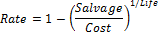

# IFinance.Db

IFinance.Db
-

# IFinance.Db

## Синтаксис

Db(

Cost: Double;

Salvage: Double;

Life: Double;

Period: Double;

Month: Integer): Double;

## Параметры

		 Параметры
		 Описание
		 Ограничения

		 Cost
		 Затраты на приобретение актива.
		 Должен быть неотрицательным.

		 Salvage
		 Стоимость в конце периода амортизации.
		 Должен принадлежать промежутку [0, Cost]

		 Life
		 Количество периодов, за которые собственность амортизируется.
		 Должен быть положительным.

		 Period
		 Период, для которого требуется вычислить амортизацию. Период
		 должен быть измерен в тех же единицах что и Life.
		 Должен принадлежать промежутку [1, Life]

		 Month
		 Количество месяцев в первом году.
		 Должен принадлежать промежутку [1, 12]

## Описание

Метод Db возвращает величину
 амортизации актива для заданного периода, рассчитанную методом фиксированного
 уменьшения остатка.

## Комментарии

Для вычисления амортизации за период метод использует следующие формулы:

(Cost - суммарная амортизация за предшествующие
 периоды) * Rate,

где:

Особым случаем является амортизация за первый и последний периоды.

Для первого периода Db использует
 такую формулу:

Cost * Rate * Month/12

Для последнего периода Db использует
 такую формулу:

((Cost - суммарная амортизация за
 предшествующие периоды) * Rate * (12 - Month))/12.

## Пример

Для выполнения примера добавьте ссылку на системную сборку MathFin.

			Sub UserProc;

Var

    r: Double;

Begin

    r := Finance.Db(54000, 1200, 24, 6, 7);

    Debug.WriteLine(r);

End Sub UserProc;

В результате выполнения примера в окно консоли будет выведена величина
 амортизации, равная «3842.1312».

См. также:

[IFinance](IFinance.htm)

		Справочная
		 система на версию 10.9
		 от 18/08/2025,
		 © ООО «ФОРСАЙТ»,
