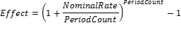

# IFinance.Effect

IFinance.Effect
-

# IFinance.Effect

## Синтаксис

Effect(NominalRate: Double; PeriodCount: Integer):
 Double;

## Параметры

		 Параметры
		 Описание
		 Ограничения

		 NominalRate
		 Номинальная годовая процентная ставка.
		 Должен быть неотрицательным.

		 PeriodCount
		 Количество периодов в году, за которое начисляются сложные
		 проценты.
		 Должен быть положительным.

## Описание

Метод Effect возвращает эффективную
 (фактическую) годовую процентную ставку.

## Комментарии

Effect вычисляется следующим
 образом:

## Пример

Для выполнения примера добавьте ссылку на системную сборку MathFin.

			Sub UserProc;

Var

    r: Double;

Begin

    r := Finance.Effect(0.25, 4);

    Debug.WriteLine(r);

End Sub UserProc;

В результате выполнения примера в окно консоли будет выведена эффективная
 годовая процентная ставка, равная «0.2744».

См. также:

[IFinance](IFinance.htm)

		Справочная
		 система на версию 10.9
		 от 18/08/2025,
		 © ООО «ФОРСАЙТ»,
