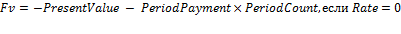

# IFinance.Fv

IFinance.Fv
-

# IFinance.Fv

## Синтаксис

Fv(

Rate: Double;

PeriodCount: Integer;

PeriodPayment: Double;

PresentValue: Double;

Type: Integer): Double;

## Параметры

		 Параметры
		 Описание
		 Ограничения

		 Rate
		 Процентная ставка за период.
		 Должен быть неотрицательным.

		 PeriodCount
		 Общее число периодов платежей на аннуитет.

		 PeriodPayment
		 Выплата, производимая в каждый период.

		 PresentValue
		 Приведенная к текущему моменту стоимость или общая сумма, которая
		 на текущий момент равноценна ряду будущих платежей.

		 Type
		 Выбор времени платежа:

0 - В конце периода;

1 - В начале периода.
		 Должен принимать значение 0 или 1.

## Описание

Метод Fv возвращает будущую
 стоимость инвестиции при условии периодических равных платежей и постоянной
 процентной ставки.

## Комментарии

Все аргументы, означающие денежные средства, которые должны быть выплачены
 (например, сберегательные вклады), представляются отрицательными числами;
 денежные средства, которые должны быть получены (например, дивиденды),
 представляются положительными числами.

Fv вычисляется следующим образом:

## Пример

Для выполнения примера добавьте ссылку на системную сборку MathFin.

			Sub UserProc;

Var

    r: Double;

Begin

    r := Finance.Fv(0.06, 4, -200, -500, 0);

    Debug.WriteLine(r);

End Sub UserProc;

В результате выполнения примера в окно консоли будет выведена будущая
 стоимость инвестиции, равная «1506.1617».

См. также:

[IFinance](IFinance.htm)

		Справочная
		 система на версию 10.9
		 от 18/08/2025,
		 © ООО «ФОРСАЙТ»,
