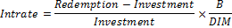

# IFinance.Intrate

IFinance.Intrate
-

# IFinance.Intrate

## Синтаксис

Intrate(Settlement: DateTime; Maturity:
DateTime; Investment: Double; Redemption: Double; [Basis: Integer
= 0]): Double;

## Параметры

Settlement. Дата расчета за
 ценные бумаги. Должен быть меньше Maturity;

Maturity. Срок погашения ценных
 бумаг. Должен быть больше Settlement;

Investment. Объем инвестиций
 в ценные бумаги. Должен быть положительным;

Redemption. Сумма, которая
 должна быть получена на момент погашения ценных бумаг. Должен быть положительным;

Basis. Используемый способ
 вычисления дня. Задается в интервале от 0 до 4:

	- 0. Способ вычисления
	 дня американский/360 дней (метод NSAD). Значение по умолчанию;

	- 1. Способ вычисления
	 дня Фактический/фактический;

	- 2. Способ вычисления
	 дня Фактический/360 дней;

	- 3. Способ вычисления
	 дня Фактический/365 дней;

	- 4. Способ вычисления
	 дня европейский 30/360 дней.

Необязательный параметр.

## Описание

Метод Intrate возвращает процентную
 ставку для полностью инвестированных ценных бумаг.

## Комментарии

Intrate вычисляется следующим
 образом:

,

где:

	- B. Число дней в году,
	 зависит от выбранного значения аргумента Basis;

	- DIM. Количество дней
	 от даты расчета до даты погашения.

## Пример

Добавьте ссылку на системную сборку MathFin.

					Sub UserProc;

		Var

		    r: Double;

		Begin

		    r := Finance.Intrate(DateTime.ComposeDay(2008,01,01), DateTime.ComposeDay(2008,06,01), 1500.5, 1600.4, 0);

		    Debug.WriteLine(r);

		End Sub UserProc;

В результате выполнения примера в окно консоли будет выведена процентная
 ставка, равная 0.16.

См. также:

[IFinance](IFinance.htm)

		Справочная
		 система на версию 10.9
		 от 18/08/2025,
		 © ООО «ФОРСАЙТ»,
