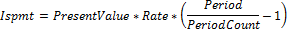

# IFinance.Ispmt

IFinance.Ispmt
-

# IFinance.Ispmt

## Синтаксис

Ispmt(Rate: Double;

Period: Integer;

PeriodCount: Integer;

PresentValue: Double):
 Double;

## Параметры

		 Параметры
		 Описание
		 Ограничения

		 Rate
		 Процентная ставка за период.

		 Period
		 Период, для которого нужно найти прибыль.
		 Должен принадлежать промежутку [1, PeriodCount].

		 PeriodCount
		 Общее число периодов выплат годовой ренты.
		 Должен быть положительным.

		 PresentValue
		 Стоимость инвестиций на текущий момент. Для займа PresentValue
		 - это сумма займа.

## Описание

Метод Ispmt возвращает проценты,
 выплачиваемые за определенный инвестиционный период.

## Комментарии

Все аргументы, означающие денежные средства, которые должны быть выплачены
 (например, сберегательные вклады), представляются отрицательными числами;
 денежные средства, которые должны быть получены (например, дивиденды),
 представляются положительными числами.

Ispmt вычисляется следующим
 образом:

## Пример

Для выполнения примера добавьте ссылку на системную сборку MathFin.

			Sub UserProc;

Var

    r: Double;

Begin

    r := Finance.Ispmt(0.15, 1, 12, 1200);

    Debug.WriteLine(r);

End Sub UserProc;

В результате выполнения примера в окно консоли будут выведены проценты,
 равные «-165».

См. также:

[IFinance](IFinance.htm)

		Справочная
		 система на версию 10.9
		 от 18/08/2025,
		 © ООО «ФОРСАЙТ»,
