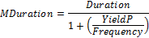

# IFinance.MDuration

IFinance.MDuration
-

# IFinance.MDuration

## Синтаксис

MDuration(Settlement: DateTime; Maturity:
DateTime; CouponRate: Double; YieldP: Double; Frequency: Integer;
[Basis: Integer = 0]): Double;

## Параметры

Settlement. Дата расчета за
 ценные бумаги. Должен быть меньше Maturity;

Maturity. Срок погашения ценных
 бумаг. Должен быть больше Settlement;

CouponRate. Годовая процентная
 ставка для купонов по ценным бумагам. Должен быть неотрицательным;

YieldP. Годовой доход по ценным
 бумагам. Должен быть неотрицательным;

Frequency. Количество купонных
 выплат в год. Параметр может принимать следующие значения:

	- 1. Ежегодные выплаты;

	- 2. Полугодовые выплаты;

	- 4. Ежеквартальные выплаты;

Basis. Используемый способ
 вычисления дня. Задается в интервале от 0 до 4:

	- 0. Способ вычисления
	 дня американский/360 дней (метод NSAD). Значение по умолчанию;

	- 1. Способ вычисления
	 дня Фактический/фактический;

	- 2. Способ вычисления
	 дня Фактический/360 дней;

	- 3. Способ вычисления
	 дня Фактический/365 дней;

	- 4. Способ вычисления
	 дня европейский 30/360 дней.

Необязательный параметр.

## Описание

Метод Mduration возвращает модифицированную
 продолжительность Маколея (Macaulay duration) для ценных бумаг с предполагаемой
 номинальной стоимостью 100 руб.

## Комментарии

Mduration вычисляется следующим
 образом:

.

Для получения продолжительности Маколея (Macaulay duration) используйте
 метод [IFinance.Duration](IFinance.Duration.htm).

## Пример

Для выполнения примера добавьте ссылку на системную сборку MathFin.

					Sub UserProc;

		Var

		    r: Double;

		Begin

		    r := Finance.Mduration(DateTime.ComposeDay(2008,01,01), DateTime.ComposeDay(2016,01,01), 0.28, 0.82, 4, 3);

		    Debug.WriteLine(r);

		End Sub UserProc;

В результате выполнения примера в окно консоли будет выведена модифицированная
 продолжительность Маколея (Macaulay duration), равная 1.243.

См. также:

[IFinance](IFinance.htm)

		Справочная
		 система на версию 10.9
		 от 18/08/2025,
		 © ООО «ФОРСАЙТ»,
