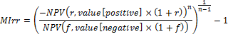

# IFinance.MIrr

IFinance.MIrr
-

# IFinance.MIrr

## Синтаксис

MIrr(Values: Array; FinanceRate: Double; ReinvestRate: Double): Double;

## Параметры

		 Параметры
		 Описание
		 Ограничения

		 Values
		 Массив, содержащий числа, для которых требуется подсчитать
		 внутреннюю ставку доходности.
		 Необходимо использовать массив типа [Double](Fore.chm::/03_dataTypes/Fore_DataTypes.htm).

		 FinanceRate
		 Ставка процента, выплачиваемого за деньги, используемые в денежных
		 потоках.
		 Не может быть равен «0».

		 ReinvestRate
		 Ставка процента, получаемого на денежных потоках при их реинвестировании.

## Описание

Метод Mirr возвращает модифицированную
 внутреннюю ставку доходности для ряда периодических денежных потоков.

## Комментарии

Values должны содержать, по
 крайней мере, одну положительную и одну отрицательную величину.

Mirr вычисляется следующим образом:

Где:

	- n. Количество чисел
	 в аргументе Values;

	- f. Параметр FinanceRate;

	- r. Параметр ReinvestRate;

	- NPV(Rate,Values). Величина
	 чистой приведенной стоимости инвестиции, рассчитанная на основе заданных
	 параметров.

## Примерe

Для выполнения примера добавьте ссылку на системную сборку MathFin.

  			Sub UserProc;

Var

    r: Double;

    Arr: Array[3] Of Double;

Begin

    Arr[0] := -1;

    Arr[1] := 1.5;

    Arr[2] := 2.5;

    r := Finance.MIrr(Arr, 0.15,
 0.1);

    Debug.WriteLine(r);

End Sub UserProc;

В результате выполнения примера в окно консоли будет выведена модифицированная
 внутренняя ставка доходности, равная «1.0372».

См. также:

[IFinance](IFinance.htm)

		Справочная
		 система на версию 10.9
		 от 18/08/2025,
		 © ООО «ФОРСАЙТ»,
