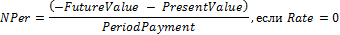

# IFinance.NPer

IFinance.NPer
-

# IFinance.NPer

## Синтаксис

NPer(Rate: Double;

PeriodPayment; Double;

PresentValue: Double;

FutureValue: Double;

Type: Integer): Double;

## Параметры

		 Параметры
		 Описание
		 Ограничения

		 Rate
		 Процентная ставка за период.
		 Должен быть неотрицательным.

		 PeriodPayment
		 Выплата, производимая в каждый период; это значение не может
		 меняться в течение всего периода выплат. Обычно платеж состоит
		 из основного платежа и платежа по процентам и не включает налогов
		 и сборов.

		 PresentValue
		 Приведенная к текущему моменту стоимость или общая сумма, которая
		 на текущий момент равноценна ряду будущих платежей.

		 FutureValue
		 Требуемое значение будущей стоимости или остатка средств после
		 последней выплаты.

		 Type
		 Выбор времени платежа:

0 - В конце периода;

1 - В начале периода.
		 Должен принимать значение 0 или 1.

## Описание

Метод NPer возвращает общее
 количество периодов выплаты для инвестиции на основе периодических постоянных
 выплат и постоянной процентной ставки.

## Комментарии

NPer вычисляется следующим образом:

## Пример

Для выполнения примера добавьте ссылку на системную сборку MathFin.

			Sub UserProc;

Var

    r: Double;

Begin

    r := Finance.NPer(0.011, -100, -800, 5000, 0);

    Debug.WriteLine(r);

End Sub UserProc;

В результате выполнения примера в окно консоли будет выведено общее
 количество периодов выплат, равное «32.35».

См. также:

[IFinance](IFinance.htm)

		Справочная
		 система на версию 10.9
		 от 18/08/2025,
		 © ООО «ФОРСАЙТ»,
