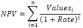

# IFinance.Npv

IFinance.Npv
-

# IFinance.Npv

## Синтаксис

Npv(Rate: Double; Values: Array): Double;

## Параметры

		 Параметры
		 Описание
		 Ограничения

		 Rate
		 Ставка дисконтирования за один период.
		 Не может быть равен «0»

		 Values
		 Массив аргументов, представляющих расходы и доходы.
		 Необходимо использовать массив типа [Double](Fore.chm::/03_dataTypes/Fore_DataTypes.htm).

## Описание

Метод Npv возвращает величину
 чистой приведенной стоимости инвестиции, используя ставку дисконтирования,
 а также стоимости будущих выплат (отрицательные значения) и поступлений
 (положительные значения).

## Комментарии

Считается, что инвестиция, значение которой вычисляет метод Npv,
 начинается за один период до даты денежного взноса Values
 и заканчивается с последним денежным взносом в списке. Вычисления метода
 Npv базируются на будущих денежных
 взносах. Если первый денежный взнос приходится на начало первого периода,
 то первое значение следует добавить к результату метода Npv,
 но не включать в список аргументов.

Npv вычисляется следующим образом:

Где n – количество чисел в
 аргументе Values.

## Пример

Для выполнения примера добавьте ссылку на системную сборку MathFin.

					Sub UserProc;

		Var

		    r: Double;

		    Arr: Array[3] Of Double;

		Begin

		    Arr[0] := -1;

		    Arr[1] := 1.5;

		    Arr[2] := 2.5;

		    r := Finance.Npv(0.15, Arr);

		    Debug.WriteLine(r);

		End Sub UserProc;

В результате выполнения примера в окно консоли будет выведена величина
 чистой приведенной стоимости инвестиции, равная «1.9084».

См. также:

[IFinance](IFinance.htm)

		Справочная
		 система на версию 10.9
		 от 18/08/2025,
		 © ООО «ФОРСАЙТ»,
