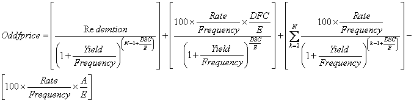
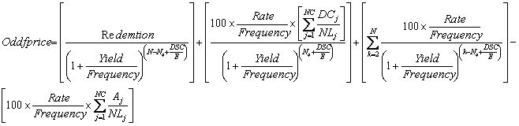

# IFinance.OddfPrice

IFinance.OddfPrice
-

# IFinance.OddfPrice

## Синтаксис

OddfPrice(Settlement: DateTime; Maturity:
DateTime; Issue: DateTime; FirstCouponDate: DateTime; Rate: Double;
YieldP: Double; Redemption: Double; Frequency; Integer; [Basis;
Integer = 0]): Double;

## Параметры

Settlement. Дата расчета за
 ценные бумаги. Должен быть больше Issue;

Maturity. Срок погашения ценных
 бумаг. Должен быть больше FirstCouponDate;

Issue. Дата выпуска ценных
 бумаг. Должен быть меньше Settlement;

FirstCouponDate. Дата первого
 купона для ценных бумаг. Должен быть больше Settlement;

Rate. Годовая процентная ставка
 для купонов по ценным бумагам. Должен быть положительным;

YieldP. Годовой доход по ценным
 бумагам. Должен быть неотрицательным;

Redemption. Выкупная стоимость
 ценных бумаг за 100 руб. номинальной стоимости. Должен быть положительным;

Frequency. Количество купонных
 выплат в год. Параметр может принимать следующие значения:

	- 1. Ежегодные выплаты;

	- 2. Полугодовые выплаты;

	- 4. Ежеквартальные выплаты;

Basis. Используемый способ
 вычисления дня. Задается в интервале от 0 до 4:

	- 0. Способ вычисления
	 дня американский/360 дней (метод NSAD). Значение по умолчанию;

	- 1. Способ вычисления
	 дня Фактический/фактический;

	- 2. Способ вычисления
	 дня Фактический/360 дней;

	- 3. Способ вычисления
	 дня Фактический/365 дней;

	- 4. Способ вычисления
	 дня европейский 30/360 дней.

Необязательный параметр.

## Описание

Метод OddfPrice возвращает цену
 за 100 рублей номинальной стоимости ценных бумаг для нерегулярного: короткого
 или длинного, первого периода.

## Комментарии

OddfPrice вычисляется следующим
 образом.

Нерегулярный короткий первый купон:

,

где:

	- A. Количество дней
	 от начала периода купона до даты расчета (накопленные дни);

	- DSC. Количество дней
	 от даты расчета до даты следующего купона;

	- DFC. Количество дней
	 от начала нерегулярного купона до даты первого купона;

	- E. Количество дней
	 в периоде купона;

	- N. Количество оплачиваемых
	 купонов между датой расчета и датой погашения. Если это число является
	 дробным, то оно округляется с избытком до ближайшего целого.

Нерегулярный длинный первый купон:

,

где:

	- Aj.
	 Количество дней от начала j-го или последнего квазикупонного периода
	 в нерегулярном периоде;

	- DCj.
	 Количество дней от указанной даты (или даты выпуска) до первого квазикупона
	 (j = 1) или количество дней в квазикупоне (j = 2,…, j = NC);

	- DSC. Количество дней
	 от даты расчета до даты следующего купона;

	- E. Количество дней
	 в периоде купона;

	- N. Количество оплачиваемых
	 купонов от даты первого фактического купона до даты погашения. (Если
	 это число является дробным, то оно округляется с избытком до ближайшего
	 целого;

	- NC. Количество периодов
	 квазикупонов, укладывающихся в нерегулярный период. Если это число
	 является дробным, то оно округляется с избытком до ближайшего целого;

	- NLj.
	 Нормальная продолжительность в днях полного j-го или последнего квазикупонного
	 периода в нерегулярном периоде;

	- Nq.
	 Количество полных периодов квазикупонов от даты расчета до первого
	 купона.

## Пример

Добавьте ссылку на системную сборку MathFin.

					Sub UserProc;

		Var

		    r: Double;

		Begin

		    r := Finance.OddfPrice(DateTime.ComposeDay(2008,11,11), DateTime.ComposeDay(2021,03,01),

		        DateTime.ComposeDay(2008,10,15), DateTime.ComposeDay(2009,03,01), 0.1275, 0.1025, 200, 4, 3);

		    Debug.WriteLine(r);

		End Sub UserProc;

В результате выполнения примера в окно консоли будет выведена цена,
 равная 146.115.

См. также:

[IFinance](IFinance.htm)

		Справочная
		 система на версию 10.9
		 от 18/08/2025,
		 © ООО «ФОРСАЙТ»,
