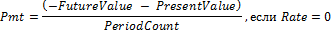

# IFinance.Pmt

IFinance.Pmt
-

# IFinance.Pmt

## Синтаксис

Pmt(

Rate: Double;

PeriodCount: Integer;

PresentValue: Double;

FutureValue: Double;

Type: Integer): Double;

## Параметры

		 Параметры
		 Описание
		 Ограничения

		 Rate
		 Процентная ставка по ссуде.
		 Должен быть неотрицательным.

		 PeriodCount
		 Общее число выплат по ссуде.
		 Должен быть положительным.

		 PresentValue
		 Приведенная к текущему моменту стоимость, или общая сумма,
		 которая на текущий момент равноценна ряду будущих платежей, называемая
		 также основной суммой.

		 FutureValue
		 Требуемое значение будущей стоимости, или остатка средств после
		 последней выплаты.

		 Type
		 Выбор времени платежа:

0 - В конце периода;

1 - В начале периода.
		 Должен принимать значения 0 или 1.

## Описание

Метод Pmt возвращает сумму периодического
 платежа для аннуитета на основе постоянства сумм платежей и постоянства
 процентной ставки.

## Комментарии

Pmt вычисляется следующим образом:

## Пример

Для выполнения примера добавьте ссылку на системную сборку MathFin.

			Sub UserProc;

Var

    r: Double;

Begin

    r := Finance.Pmt(0.01, 12, 50000, 0, 0);

    Debug.WriteLine(r);

End Sub UserProc;

В результате выполнения примера в окно консоли будет выведена сумма
 периодического платежа, равная «-4442.43».

См. также:

[IFinance](IFinance.htm)

		Справочная
		 система на версию 10.9
		 от 18/08/2025,
		 © ООО «ФОРСАЙТ»,
