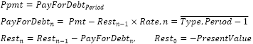

# IFinance.Ppmt

IFinance.Ppmt
-

# IFinance.Ppmt

## Синтаксис

Ppmt(Rate: Double;

Period: Integer;

PeriodCount: Integer;

PresentValue: Double;

FutureValue: Double;

Type: Integer): Double;

## Параметры

		 Параметры
		 Описание
		 Ограничения

		 Rate
		 Процентная ставка по ссуде.
		 Должен быть неотрицательным.

		 Period
		 Период.
		 Должен принадлежать промежутку [1, PeriodCount].

		 PeriodCount
		 Общее число выплат по ссуде.
		 Должен быть положительным.

		 PresentValue
		 Приведенная к текущему моменту стоимость, или общая сумма,
		 которая на текущий момент равноценна ряду будущих платежей, называемая
		 также основной суммой.

		 FutureValue
		 Требуемое значение будущей стоимости, или остатка средств после
		 последней выплаты.

		 Type
		 Выбор времени платежа:

0 - В конце периода;

1 - В начале периода.
		 Должен принимать значения 0 или 1.

## Описание

Метод Ppmt возвращает величину
 платежа в погашение основной суммы по инвестиции за данный период на основе
 постоянства периодических платежей и постоянства процентной ставки.

## Комментарии

Ppmt вычисляется следующим образом:

Где Pmt - ежемесячный платеж
 по займу.

Для получения ежемесячного платежа по займу используйте метод [IFinance.Pmt](IFinance.Pmt.htm).

## Пример

Для выполнения примера добавьте ссылку на системную сборку MathFin.

			Sub UserProc;

Var

    r: Double;

Begin

    r := Finance.Ppmt(0.01, 3, 12, 50000, 0, 0);

    Debug.WriteLine(r);

End Sub UserProc;

В результате выполнения примера в окно консоли будет выведена величина
 платежа, равная «-4021.683».

См. также:

[IFinance](IFinance.htm)

		Справочная
		 система на версию 10.9
		 от 18/08/2025,
		 © ООО «ФОРСАЙТ»,
