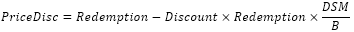

# IFinance.PriceDisc

IFinance.PriceDisc
-

# IFinance.PriceDisc

## Синтаксис

PriceDisc(Settlement: DateTime; Maturity:
DateTime; Discount: Double; Redemption: Double; [Basis: Integer
= 0]): Double;

## Параметры

Settlement. Дата расчета за
 ценные бумаги. Должен быть больше Maturity;

Maturity. Срок погашения ценных
 бумаг. Должен быть больше Settlement;

Discount. Годовая процентная
 ставка для купонов по ценным бумагам. Должен быть неотрицательным;

Redemption. Выкупная стоимость
 ценных бумаг в расчете на 100 рублей номинальной стоимости. Должен быть
 положительным;

Basis. Используемый способ
 вычисления дня. Задается в интервале от 0 до 4:

	- 0. Способ вычисления
	 дня американский/360 дней (метод NSAD). Значение по умолчанию;

	- 1. Способ вычисления
	 дня Фактический/фактический;

	- 2. Способ вычисления
	 дня Фактический/360 дней;

	- 3. Способ вычисления
	 дня Фактический/365 дней;

	- 4. Способ вычисления
	 дня европейский 30/360 дней.

Необязательный параметр.

## Описание

Метод PriceDisc возвращает цену
 за 100 рублей номинальной стоимости ценных бумаг, на которые сделана скидка.

## Комментарии

PriceDisc вычисляется по следующей
 формуле:

,

где:

	- B. Количество дней
	 в году, зависит от используемого базиса;

	- DSM. Количество дней
	 от даты расчета до даты погашения.

## Пример

Добавьте ссылку на системную сборку MathFin.

					Sub UserProc;

		Var

		    r: Double;

		Begin

		    r := Finance.PriceDisc(DateTime.ComposeDay(2008,01,01), DateTime.ComposeDay(2008,06,01), 0.2, 150, 0);

		    Debug.WriteLine(r);

		End Sub UserProc;

В результате выполнения примера в окно консоли будет выведена цена,
 равная 137.5.

См. также:

[IFinance](IFinance.htm)

		Справочная
		 система на версию 10.9
		 от 18/08/2025,
		 © ООО «ФОРСАЙТ»,
