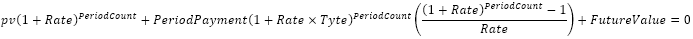
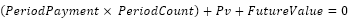

# IFinance.Pv

IFinance.Pv
-

# IFinance.Pv

## Синтаксис

Pv(

Rate: Double;

PeriodCount: Integer;

PeriodPayment: Double;

FutureValue: Double;

Type: Integer): Double;

## Параметры

		 Параметры
		 Описание
		 Ограничения

		 Rate
		 Процентная ставка по ссуде.
		 Должен быть неотрицательным.

		 PeriodCount
		 Общее число периодов платежей по аннуитету.
		 Должен быть положительным.

		 PeriodPayment
		 Выплата, производимая в каждый период и не меняющаяся за все
		 время выплаты ренты. Обычно выплаты включают основные платежи
		 и платежи по процентам, но не включают других сборов или налогов.

		 FutureValue
		 Требуемое значение будущей стоимости или остатка средств после
		 последней выплаты. Если аргумент опущен, он полагается равным
		 0 (будущая стоимость займа, например, равна 0).

		 Type
		 Выбор времени платежа:

0 - В конце периода;

1 - В начале периода.
		 Должен принимать значения 0 или 1.

## Описание

Метод Pv возвращает приведенную
 (к текущему моменту) стоимость инвестиции.

## Комментарии

Стоимость инвестиций вычисляется на основе решения следующих равенств:

Если ставка равна 0, то

Если ставка не равна 0, то

## Пример

Для выполнения примера добавьте ссылку на системную сборку MathFin.

			Sub UserProc;

Var

    r: Double;

Begin

    r := Finance.Pv(0.15, 12, 122, 12000, 1);

    Debug.WriteLine(r);

End Sub UserProc;

В результате выполнения примера в окно консоли будет выведена стоимость
 инвестиций, равная «3003.399».

См. также:

[IFinance](IFinance.htm)

		Справочная
		 система на версию 10.9
		 от 18/08/2025,
		 © ООО «ФОРСАЙТ»,
