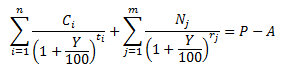

# IFinance.RedemptionYield

IFinance.RedemptionYield
-

# IFinance.RedemptionYield

## Синтаксис

		RedemptionYield(

		Price: Double;

		AccumulateIncome: Double;

		CouponsDates: Array;

		Coupons: Array;

		PaymentsDates: Array;

		Payments: Array;

		Settlement: DateTime): Double;

## Параметры

		 Параметры
		 Описание
		 Ограничения

		 Price
		 Цена облигации.
		 Должен быть положительным.

		 AccumulateIncome
		 Накопленный купонный доход.
		 Должен быть неотрицательным.

		 CouponsDates
		 Массив с датами выплат по купону.
		 Необходимо использовать массив типа [DateTime](Fore.chm::/03_dataTypes/Fore_DataTypes.htm).

		 Coupons
		 Массив с размерами купонов.
		 Необходимо использовать массив типа [Double](Fore.chm::/03_dataTypes/Fore_DataTypes.htm).

		 PaymentsDates
		 Массив с датами выплат номинальной стоимости.
		 Необходимо использовать массив типа [DateTime](Fore.chm::/03_dataTypes/Fore_DataTypes.htm).

		 Payments
		 Массив с размерами выплат номинальной стоимости.
		 Необходимо использовать массив типа [Double](Fore.chm::/03_dataTypes/Fore_DataTypes.htm).

		 Settlement
		 Дата, на которую производится расчет.
		 Должен быть меньше каждого элемента массивов CouponsDates
		 и PaymentsDates.

## Описание

Метод RedemptionYield
 возвращает эффективную доходность к погашению.

## Комментарии

Эффективная доходность вычисляется на основе
 решения следующего равенства:

Где:

	- P.
	 Цена облигации;

	- A.
	 Накопленный купонный доход;

	- Y.
	 Эффективная доходность к погашению, в % годовых;

	- ti.
	 Число дней до выплаты i-го
	 купона;

	- n.
	 Количество купонов;

	- rj.
	 Срок до j-ой выплаты номинальной
	 стоимости (в днях);

	- m.
	 Количество платежей по основной сумме долга;

	- Ci.
	 Размер соответствующего купона;

	- Nj.
	 Размер выплаты, соответствующий дате выплаты номинальной стоимости.

Равенство решается относительно переменной
 Y, которая является искомой величиной.

Размерность массива CouponsDates
 должна соответствовать размерности массива Coupons.

Размерность массива PaymentsDates
 должна соответствовать размерности массива Payments.

## Пример

Добавьте ссылку на системную сборку MathFin.

					Sub UserProc;

		Var

		    Price, AccumulateIncome, Result: Double;

		    CouponsDates: Array[5] Of DateTime;

		    Coupons: Array[5] Of Double;

		    PaymentsDates: Array[2] Of DateTime;

		    Payments: Array[2] Of Double;

		    Settlement: DateTime;

		Begin

		    // Цена облигации

		    Price := 1150;

		    // Накопленный доход по купонам

		    AccumulateIncome := 40;

		    // Массив с датами выплат по купону

		    CouponsDates[0] := DateTime.ComposeDay(2006, 1, 1);

		    CouponsDates[1] := DateTime.ComposeDay(2006, 4, 1);

		    CouponsDates[2] := DateTime.ComposeDay(2006, 7, 1);

		    CouponsDates[3] := DateTime.ComposeDay(2006, 10, 1);

		    CouponsDates[4] := DateTime.ComposeDay(2007, 1, 1);

		    // Массив с размерами купонов

		    Coupons[0] := 80;

		    Coupons[1] := 80;

		    Coupons[2] := 80;

		    Coupons[3] := 80;

		    Coupons[4] := 80;

		    // Массив с датами выплат номинальной стоимости

		    PaymentsDates[0] := DateTime.ComposeDay(2007, 1, 1);

		    PaymentsDates[1] := DateTime.ComposeDay(2007, 4, 1);

		    // Массив с размерами выплат номинальной стоимости

		    Payments[0] := 500;

		    Payments[1] := 500;

		    Settlement := DateTime.ComposeDay(2005, 11, 15); // Дата, на которую производится расчет

		    // Строка результата метода

		    Result := Finace.RedemptionYield(Price, AccumulateIncome, CouponsDates, Coupons, PaymentsDates, Payments, Settlement);

		    debug.WriteLine(Result); // Вывод результата в окно консоли

		    debug.WriteLine(Finance.ErrorMsg);

		End Sub UserProc;

В результате выполнения примера в окно консоли будет выведена эффективная
 доходность, равная 16,51%.

См. также:

[IFinance](IFinance.htm)

		Справочная
		 система на версию 10.9
		 от 18/08/2025,
		 © ООО «ФОРСАЙТ»,
