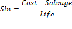

# IFinance.Sln

IFinance.Sln
-

# IFinance.Sln

## Синтаксис

Sln(Cost: Double; Salvage: Double; Life: Integer):
 Double;

## Параметры

		 Параметры
		 Описание
		 Ограничения

		 Cost
		 Затраты на приобретение актива.
		 Должен быть неотрицательным.

		 Salvage
		 Стоимость в конце периода амортизации.
		 Должен принадлежать промежутку [0, Cost].

		 Life
		 Количество периодов, за которые актив амортизируется.
		 Должен быть положительным.

## Описание

Метод Sln возвращает величину
 амортизации актива за один период, рассчитанную линейным методом.

## Комментарии

Sln вычисляется следующим образом:

## Пример

Для выполнения примера добавьте ссылку на системную сборку MathFin.

			Sub UserProc;

Var

    r: Double;

Begin

    r := Finance.Sln(15000.1, 1000, 24);

    Debug.WriteLine(r);

End Sub UserProc;

В результате выполнения примера в окно консоли будет выведено значение
 амортизации актива, равное «583.3375».

См. также:

[IFinance](IFinance.htm)

		Справочная
		 система на версию 10.9
		 от 18/08/2025,
		 © ООО «ФОРСАЙТ»,
