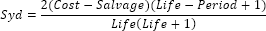

# IFinance.Syd

IFinance.Syd
-

# IFinance.Syd

## Синтаксис

Syd(Cost: Double; Salvage: Double; Life: Double;
 Period: Double): Double;

## Параметры

		 Параметры
		 Описание
		 Ограничения

		 Cost
		 Затраты на приобретение актива.
		 Должен быть неотрицательным.

		 Salvage
		 Стоимость в конце периода амортизации.
		 Должен принадлежать промежутку [0, Cost].

		 Life
		 Количество периодов, за которые актив амортизируется.
		 Должен быть положительным.

		 Period
		 Период (должен быть измерен в тех же единицах, что и время
		 полной амортизации).
		 Должен принадлежать промежутку [1, Life].

## Описание

Метод Syd возвращает величину
 амортизации актива за данный период, рассчитанную методом «суммы (годовых)
 чисел».

## Комментарии

Syd вычисляется следующим образом:

## Пример

Для выполнения примера добавьте ссылку на системную сборку MathFin.

			Sub UserProc;

Var

    r: Double;

Begin

    r := Finance.Syd(15000.1, 1000, 24, 5);

    Debug.WriteLine(r);

End Sub UserProc;

В результате выполнения примера в окно консоли будет выведена величина
 амортизации актива за период, равная «933.34».

См. также:

[IFinance](IFinance.htm)

		Справочная
		 система на версию 10.9
		 от 18/08/2025,
		 © ООО «ФОРСАЙТ»,
