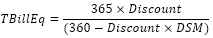

# IFinance.TBillEq

IFinance.TBillEq
-

# IFinance.TBillEq

## Синтаксис

TBillEq(Settlement: DateTime; Maturity: DateTime;
 Discount: Double): Double;

## Параметры

		 Параметры
		 Описание
		 Ограничения

		 Settlement
		 Дата расчета за казначейский вексель.
		 Должен быть меньше Maturity.

		 Maturity
		 Срок погашения для казначейского векселя.
		 Должен быть больше Settlement.

		 Discount
		 Скидка на казначейский вексель.
		 Должен быть положительным.

## Описание

Метод TBillEq возвращает доход
 по казначейскому векселю, эквивалентный облигации.

## Комментарии

TBillEq вычисляется следующим
 образом:

Где:

DSM
 - это количество дней между аргументами Settlement
 и Maturity, вычисленное на базе
 360-дневного года.

## Пример

Для выполнения примера добавьте ссылку на системную сборку MathFin.

			Sub UserProc;

Var

    r: Double;

Begin

    r := Finance.TBillEq(DateTime.ComposeDay(2007,01,01), DateTime.ComposeDay(2008,09,01), 0.05);

    Debug.WriteLine(r);

End Sub UserProc;

В результате выполнения примера в окно консоли будет выведен доход,
 равный «0.0553».

См. также:

[IFinance](IFinance.htm)

		Справочная
		 система на версию 10.9
		 от 18/08/2025,
		 © ООО «ФОРСАЙТ»,
