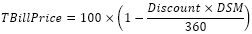

# IFinance.TBillPrice

IFinance.TBillPrice
-

# IFinance.TBillPrice

## Синтаксис

TBillPrice(Settlement: DateTime, Maturity: DateTime, Discount: Double): Double;

## Параметры

Settlement. Дата расчета за
 казначейский вексель;

Maturity. Срок погашения для
 казначейского векселя;

Discount. Скидка на казначейский
 вексель.

## Описание

Метод TBillPrice возвращает
 цену на 100 руб. номинальной стоимости для казначейского векселя.

## Комментарии

Значение параметра Settlement
 должно быть меньше значения параметра Maturity.

Значение параметра Discount
 должно быть положительным.

Метод вычисляется следующим образом:

,

где:

	- DSM. Количество дней
	 от даты расчета Settlement до
	 даты погашения Maturity,
	 вычисленное на основе 360-дневного года.

## Пример

Для выполнения примера добавьте ссылку на системную сборку MathFin.

					Sub UserProc;

		Var

		    r: Double;

		Begin

		    r := Finance.TBillPrice(DateTime.ComposeDay(2007,01,01), DateTime.ComposeDay(2008,09,01), 0.05);

		    Debug.WriteLine(r);

		End Sub UserProc;

В результате выполнения примера в окно консоли будет выведена цена,
 равная 91,67.

См. также:

[IFinance](IFinance.htm)

		Справочная
		 система на версию 10.9
		 от 18/08/2025,
		 © ООО «ФОРСАЙТ»,
