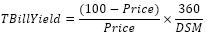

# IFinance.TBillYield

IFinance.TBillYield
-

# IFinance.TBillYield

## Синтаксис

TBillYield(Settlement: DateTime, Maturity:
DateTime, Price: Double): Double;

## Параметры

Settlement. Дата расчета за
 казначейский вексель;

Maturity. Срок погашения для
 казначейского векселя;

Price. Цена казначейского векселя
 на 100 руб. номинальной стоимости.

## Описание

Метод TBillYield возвращает
 доход по казначейскому векселю.

## Комментарии

Значение параметра Settlement
 должно быть меньше значения параметра Maturity.

Значение параметра Price должно
 быть положительным.

Метод вычисляется следующим образом:

,

где:

	- DSM. Количество дней
	 от даты расчета Settlement до
	 даты погашения Maturity,
	 вычисленное на основе 360-дневного года.

## Пример

Для выполнения примера добавьте ссылку на системную сборку MathFin.

					Sub UserProc;

		Var

		    r: Double;

		Begin

		    r := Finance.TBillYield(DateTime.ComposeDay(2007,01,01), DateTime.ComposeDay(2008,09,01), 87.79);

		    Debug.WriteLine(r);

		End Sub UserProc;

В результате выполнения примера в окно консоли будет выведен доход,
 равный 0,0834.

См. также:

[IFinance](IFinance.htm)

		Справочная
		 система на версию 10.9
		 от 18/08/2025,
		 © ООО «ФОРСАЙТ»,
