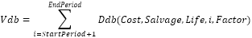

# IFinance.Vdb

IFinance.Vdb
-

# IFinance.Vdb

## Синтаксис

Vdb(

Cost: Double;

Salvage: Double;

Life: Double;

StartPeriod: Double;

EndPeriod: Double;

Factor: Double;

NoSwitch: Boolean): Double;

## Параметры

		 Параметры
		 Описание
		 Ограничения

		 Cost
		 Начальная стоимость актива.
		 Должен быть неотрицательным.

		 Salvage
		 Стоимость в конце периода амортизации.
		 Должен принадлежать промежутку [0, Cost].

		 Life
		 Число периодов амортизации актива
		 Должен быть положительным.

		 StartPeriod
		 Начальный период, для которого вычисляется амортизация.
		 Должен принадлежать промежутку [1, Life].

		 EndPeriod
		 Конечный период, для которого вычисляется амортизация.
		 Должен принадлежать промежутку [StartPeriod, PeriodCount].

		 Factor
		 Процентная ставка снижающегося остатка.
		 Должен быть положительным.

		 NoSwitch
		 Логическое значение, определяющее, следует ли использовать
		 линейную амортизацию в том случае, когда амортизация превышает
		 величину, рассчитанную методом снижающегося остатка.

## Описание

Метод Vdb возвращает величину
 амортизации актива для любого выбранного периода, в том числе для частичных
 периодов, с использованием метода двойного уменьшения остатка или иного
 указанного метода.

## Комментарии

Если параметр Factor равен 2, то для вычисления амортизации используется
 метод двойного уменьшения остатка:

Где:

Ddb(Cost,Salvage,Life,Period,Factor) - значение амортизации
 актива за заданный период.

## Пример

Для выполнения примера добавьте ссылку на системную сборку MathFin.

			Sub UserProc;

Var

    r: Double;

Begin

    r := Finance.Vdb(5000, 100, 12, 1, 3, 2, True);

    Debug.WriteLine(r);

End Sub UserProc;

В результате выполнения примера в окно консоли будет выведена величина
 амортизации актива, равная «1273.15».

См. также:

[IFinance](IFinance.htm)

		Справочная
		 система на версию 10.9
		 от 18/08/2025,
		 © ООО «ФОРСАЙТ»,
