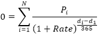

# IFinance.XIrr

IFinance.XIrr
-

# IFinance.XIrr

## Синтаксис

XIrr(Values: Array; DateTimes: Array; Guess: Double): Double;

## Параметры

		 Параметры
		 Описание
		 Ограничения

		 Values
		 Ряд денежных потоков, соответствующий графику платежей. Первый
		 платеж является необязательным и соответствует выплате в начале
		 инвестиции. Все последующие выплаты дисконтируются на основе 365-дневного
		 года.
		 Необходимо использовать массив типа [Double](Fore.chm::/03_dataTypes/Fore_DataTypes.htm).

		 DateTimes
		 График платежей, который соответствует ряду денежных потоков.
		 Первая дата - начальная в графике платежей. Все другие даты должны
		 быть позже этой даты, но могут идти в произвольном порядке.
		 Необходимо использовать массив типа [DateTime](Fore.chm::/03_dataTypes/Fore_DataTypes.htm).

		 Guess
		 Предполагаемое значение результата функции XIrr.

## Описание

Метод XIrr возвращает внутреннюю
 ставку доходности для графика денежных потоков, которые не обязательно
 носят периодический характер.

## Комментарии

Ряд значений Values должен
 содержать, по крайней мере, одно положительное и одно отрицательное значение.

Используется итеративный метод для вычисления XIrr.
 Используя меняющуюся ставку Rate
 (начиная со значения параметра Guess),
 функция XIrr производит циклические
 вычисления, пока не получит результат с точностью до 0,000001 процента.
 Если функции XIrr не удается найти
 результат за 100 попыток, то возвращается значение ошибки. Ставка меняется
 до тех пор, пока не достигается равенства:

Где:

	- di.
	 Дата i-ой (последней) выплаты;

	- d1.
	 Дата 0-ой выплаты (начальная дата);

	- Pi.
	 Сумма i-ой (последней) выплаты.

## Пример

Для выполнения примера добавьте ссылку на системную сборку MathFin.

					Sub UserProc;

		Var

		    r: Double;

		    Values: Array[5] Of Double;

		    Dates: Array[5] Of DateTime;

		Begin

		    Values[0] := -10000;

		    Values[1] := 2750;

		    Values[2] := 4250;

		    Values[3] := 3250;

		    Values[4] := 2750;

		    Dates[0] := DateTime.parse("01.01.2008");

		    Dates[1] := DateTime.parse("01.03.2008");

		    Dates[2] := DateTime.parse("01.10.2008");

		    Dates[3] := DateTime.parse("15.02.2009");

		    Dates[4] := DateTime.parse("01.04.2009");

		    r := Finance.XIrr(Values, Dates,
		 0.09);

		    Debug.WriteLine(r);

		End Sub UserProc;

В результате выполнения примера в окно консоли будет выведена внутренняя
 ставка доходности, равная «0.3882».

См. также:

[IFinance](IFinance.htm)

		Справочная
		 система на версию 10.9
		 от 18/08/2025,
		 © ООО «ФОРСАЙТ»,
