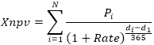

# IFinance.Xnpv

IFinance.Xnpv
-

# IFinance.Xnpv

## Синтаксис

Xnpv(Rate: Double; Values: Array; DateTimes: Array): Double;

## Параметры

		 Параметры
		 Описание
		 Ограничения

		 Rate
		 Ставка дисконтирования, применяемая к денежным потокам.
		 Должен быть положительным.

		 Values
		 Ряд денежных потоков, соответствующий графику платежей, приведенному
		 в аргументе даты. Первый платеж является необязательным и соответствует
		 выплате в начале инвестиции. Все последующие выплаты дисконтируются
		 на основе 365-дневного года.
		 Необходимо использовать массив типа [Double](Fore.chm::/03_dataTypes/Fore_DataTypes.htm).

		 DateTimes
		 Расписание дат платежей, которое соответствует ряду денежных
		 потоков. Первая дата - начальная в графике платежей. Все другие
		 даты должны быть позже этой даты, но могут идти в произвольном
		 порядке.
		 Необходимо использовать массив типа [DateTime](Fore.chm::/03_dataTypes/Fore_DataTypes.htm).

## Описание

Метод Xnpv возвращает чистую
 приведенную стоимость для денежных потоков, которые не обязательно являются
 периодическими.

## Комментарии

Ряд значений Values должен
 содержать, по крайней мере, одно положительное и одно отрицательное значение.

Функция Xnpv вычисляется следующим
 образом:

Где:

	- di.
	 Дата i-ой (последней) выплаты;

	- d1.
	 Дата 0-ой выплаты (начальная дата);

	- Pi.
	 Сумма i-ой (последней) выплаты.

## Пример

Для выполнения примера добавьте ссылку на системную сборку MathFin.

					Sub UserProc;

		Var

		    r: Double;

		    Values: Array[5] Of Double;

		    Dates: Array[5] Of DateTime;

		Begin

		    Values[0] := -10000;

		    Values[1] := 2750;

		    Values[2] := 4250;

		    Values[3] := 3250;

		    Values[4] := 2750;

		    Dates[0] := DateTime.parse("01.01.2008");

		    Dates[1] := DateTime.parse("01.03.2008");

		    Dates[2] := DateTime.parse("01.10.2008");

		    Dates[3] := DateTime.parse("15.02.2009");

		    Dates[4] := DateTime.parse("01.04.2009");

		    r := Finance.Xnpv(0.09, Values, Dates);

		    Debug.WriteLine(r);

		End Sub UserProc;

В результате выполнения примера в окно консоли будет выведена приведенная
 стоимость, равная «2113.83».

См. также:

[IFinance](IFinance.htm)

		Справочная
		 система на версию 10.9
		 от 18/08/2025,
		 © ООО «ФОРСАЙТ»,
