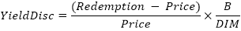

# IFinance.YieldDisc

IFinance.YieldDisc
-

# IFinance.YieldDisc

## Синтаксис

YieldDisc(Settlement: DateTime; Maturity:
DateTime; Price: Double; Redemption: Double; [Basis: Integer =
0]): Double;

## Параметры

Settlement. Дата расчета за
 ценные бумаги. Должен быть меньше Maturity;

Maturity. Срок погашения ценных
 бумаг. Должен быть больше Settlement;

Price. Цена ценных бумаг за
 100 руб. номинальной стоимости. Должен быть положительным;

Redemption. Выкупная стоимость
 ценных бумаг за 100 руб. номинальной стоимости. Должен быть положительным;

Basis. Используемый способ
 вычисления дня. Задается в интервале от 0 до 4:

	- 0. Способ вычисления
	 дня американский/360 дней (метод NSAD). Значение по умолчанию;

	- 1. Способ вычисления
	 дня Фактический/фактический;

	- 2. Способ вычисления
	 дня Фактический/360 дней;

	- 3. Способ вычисления
	 дня Фактический/365 дней;

	- 4. Способ вычисления
	 дня европейский 30/360 дней.

Необязательный параметр.

## Описание

Метод YieldDisc возвращает годовую
 доходность по ценным бумагам, на которые сделана скидка.

## Комментарии

Дата соглашения является датой продажи покупателю купона, например,
 облигации. Срок платежа представляет собой дату истечения срока действия
 купона. Предположим, например, что облигация со сроком действия 30 лет
 выпущена 1 января 2008 г. и приобретена покупателем через шесть месяцев
 после выпуска. Датой выпуска будет 1 января 2008 г., датой соглашения
 — 1 июля 2008 г., а срок погашения такой облигации наступит 1 января 2038
 г., то есть через 30 лет после даты выпуска.

YieldDisc вычисляется следующим
 образом:

,

где:

	- B.
	 Число дней в году, зависит от выбранного значения параметра Basis;

	- DIM.
	 Количество дней от даты расчета до даты погашения.

## Пример

Добавьте ссылку на системную сборку MathFin.

					Sub UserProc;

		Var

		    r: Double;

		Begin

		    r := Finance.YieldDisc(DateTime.ComposeDay(2008,02,16), DateTime.ComposeDay(2008,03,01), 99.795, 100, 2);

		    Debug.WriteLine(r);

		End Sub UserProc;

В результате выполнения примера в окно консоли будет выведена годовая
 доходность, равная 0.0528.

См. также:

[IFinance](IFinance.htm)

		Справочная
		 система на версию 10.9
		 от 18/08/2025,
		 © ООО «ФОРСАЙТ»,
