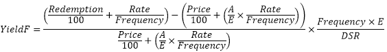

# IFinance.YieldF

IFinance.YieldF
-

# IFinance.YieldF

## Синтаксис

YieldF(Settlement: DateTime; Maturity: DateTime;
Rate: Double; Price: Double; Redemption: Double; Frequency: Integer;
[Basis: Integer = 0]): Double;

## Параметры

Settlement. Дата расчета за
 ценные бумаги. Должен быть меньше Maturity;

Maturity. Срок погашения ценных
 бумаг. Должен быть больше Settlement;

Rate. Годовая процентная ставка
 для купонов по ценным бумагам. Должен быть неотрицательным;

Price. Цена ценных бумаг за
 100 руб. номинальной стоимости. Должен быть положительным;

Redemption. Выкупная стоимость
 ценных бумаг за 100 руб. номинальной стоимости. Должен быть положительным;

Frequency. Количество купонных
 выплат в год. Параметр может принимать следующие значения:

	- 1. Ежегодные выплаты;

	- 2. Полугодовые выплаты;

	- 4. Ежеквартальные выплаты;

Basis. Используемый способ
 вычисления дня. Задается в интервале от 0 до 4:

	- 0. Способ вычисления
	 дня американский/360 дней (метод NSAD). Значение по умолчанию;

	- 1. Способ вычисления
	 дня Фактический/фактический;

	- 2. Способ вычисления
	 дня Фактический/360 дней;

	- 3. Способ вычисления
	 дня Фактический/365 дней;

	- 4. Способ вычисления
	 дня европейский 30/360 дней.

Необязательный параметр.

## Описание

Метод YieldF возвращает доходность
 ценных бумаг, по которым производятся периодические выплаты процентов.

## Комментарии

Если только один или менее периодов купона укладываются до даты погашения,
 функция YieldF вычисляется следующим
 образом:

,

где:

	- A.
	 Количество дней от начала периода купона до даты расчета (накопленные
	 дни);

	- DSR.
	 Количество дней от даты расчета до даты погашения;

	- E.-Количество
	 дней в периоде купона.

## Пример

Добавьте ссылку на системную сборку MathFin.

					Sub UserProc;

		Var

		    r: Double;

		Begin

		    r := Finance.YieldF(DateTime.ComposeDay(2008,01,01), DateTime.ComposeDay(2008,06,01), 0.15, 145, 150, 1, 0);

		    Debug.WriteLine(r);

		End Sub UserProc;

В результате выполнения примера в окно консоли будет выведена доходность
 ценных бумаг, равная 0.1756.

См. также:

[IFinance](IFinance.htm)

		Справочная
		 система на версию 10.9
		 от 18/08/2025,
		 © ООО «ФОРСАЙТ»,
