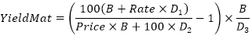

# IFinance.YieldMat

IFinance.YieldMat
-

# IFinance.YieldMat

## Синтаксис

YieldMat(Settlement: DateTime; Maturity:
DateTime; Issue: DateTime; Rate: Double; Price: Double; [Basis:
Integer = 0]): Double;

## Параметры

Settlement. Дата расчета за
 ценные бумаги. Должен быть меньше Maturity;

Maturity. Срок погашения ценных
 бумаг. Должен быть больше Settlement;

Issue. Дата выпуска ценных бумаг. Должен быть меньше Settlement;

Rate. Процентная ставка дохода
 по ценным бумагам на дату выпуска. Должен быть неотрицательным;

Price. Цена ценных бумаг за
 100 руб. номинальной стоимости. Должен быть положительным;

Basis. Используемый способ
 вычисления дня. Задается в интервале от 0 до 4:

	- 0. Способ вычисления
	 дня американский/360 дней (метод NSAD). Значение по умолчанию;

	- 1. Способ вычисления
	 дня Фактический/фактический;

	- 2. Способ вычисления
	 дня Фактический/360 дней;

	- 3. Способ вычисления
	 дня Фактический/365 дней;

	- 4. Способ вычисления
	 дня европейский 30/360 дней.

Необязательный параметр.

## Описание

Метод YieldMat возвращает годовую
 доходность ценных бумаг, по которым проценты выплачиваются при наступлении
 срока погашения.

## Комментарии

YieldMat вычисляется следующим
 образом:

,

где:

	- B.
	 Число дней в году, зависит от выбранного значения параметра Basis;

	- D1.
	 Количество дней от даты выпуска до даты погашения;

	- D2.
	 Количество дней от даты выпуска до даты расчета;

	- D3.
	 Количество дней от даты расчета до даты погашения.

## Пример

Добавьте ссылку на системную сборку MathFin.

					Sub UserProc;

		Var

		    r: Double;

		Begin

		    r := Finance.YieldMat(DateTime.ComposeDay(2008,01,01),

		        DateTime.ComposeDay(2008,06,01), DateTime.ComposeDay(2007,10,01), 0.15, 145.8, 0);

		    Debug.WriteLine(r);

		End Sub UserProc;

В результате выполнения примера в окно консоли будет выведена годовая
 доходность ценной бумаги, равная -0.6347.

См. также:

[IFinance](IFinance.htm)

		Справочная
		 система на версию 10.9
		 от 18/08/2025,
		 © ООО «ФОРСАЙТ»,
