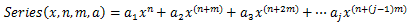

# IMath.SeriesSum

IMath.SeriesSum
-

# IMath.SeriesSum

## Синтаксис

SeriesSum(X: Double; Power: Double; Step: Double; Coefficients: Array): Double;

## Параметры

X - значение переменной степенного ряда.

Power - показатель степени X для первого члена степенного ряда.

Step - шаг, на который увеличивается показатель степени Power для каждого следующего члена степенного ряда.

Coefficients - набор коэффициентов при соответствующих степенях X.

## Описание

Метод SeriesSum возвращает сумму степенного ряда.

## Комментарии

Сумма степенного ряда вычисляется по формуле:

## Пример

Для выполнения примера добавьте ссылку на системную сборку «MathFin».

			Sub UserProc;
Var

    a: Array[1..5] Of Double;

    d: Double;
Begin

    a[1] := 2.1;

    a[2] := 6.3;

    a[3] := 3.2;

    a[4] := 8.8;

    a[5] := 4.5;

    d := Math.SeriesSum(10, 1, 1, a);

    Debug.WriteLine(d);
End Sub UserProc;

В результате выполнения примера в окно консоли будет выведена сумма степенного ряда.

См. также:

[IMath](IMath.htm)

		Справочная
		 система на версию 10.9
		 от 18/08/2025,
		 © ООО «ФОРСАЙТ»,
