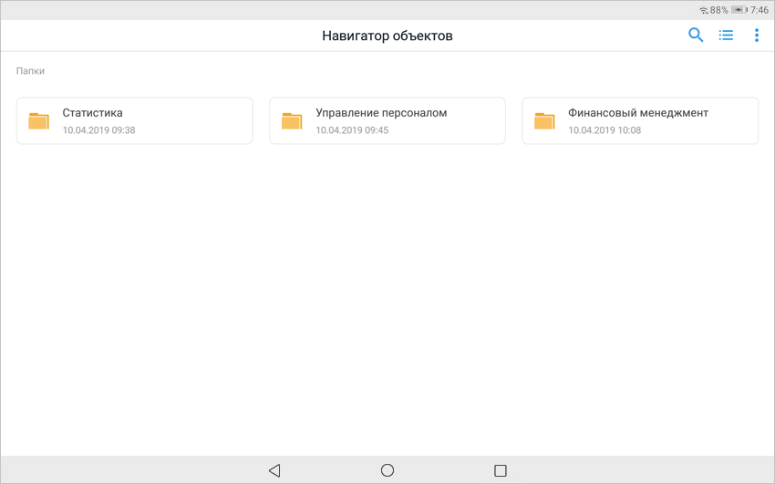
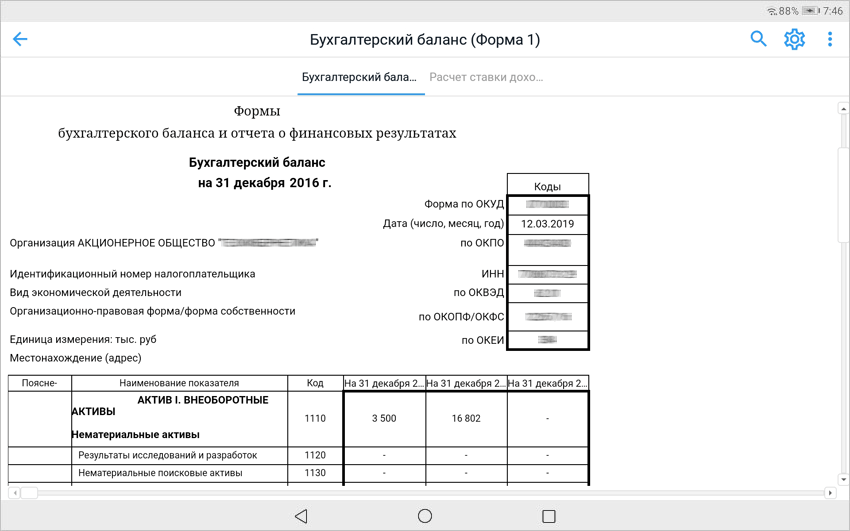

# Просмотр демо-примеров

Просмотр демо-примеров
-

# Просмотр демо-примеров

Демо-примеры содержат предустановленные демонстрационные аналитические
 панели и отчёты с ограниченной функциональностью.

Для просмотра демо-примеров:

	- Нажмите кнопку «Демо-примеры»
	 на [экране регистрации](Get_started_mobile.htm#connection).

Примечание.
 Просмотр демо-примеров доступен без [настройки
 подключения](Get_started_mobile.htm#connection) к серверу мобильной платформы и входа в систему.

После выполнения действия будет открыт навигатор
 объектов с демо-примерами:

Примечание. При просмотре демо-примеров в навигаторе объектов
 отсутствуют вкладки «[Навигатор](../Navigator/Navigator.htm)»,
 «[Избранное](../Navigator/Navigator.htm)», недоступен выбор [домашней
 страницы](../Navigator/Navigator.htm#setting) и [обновление
 объектов](../Navigator/Navigator.htm#update).

	- Выберите аналитическую панель или отчёт.

После выполнения действий будет открыта аналитическая панель или отчёт
 для просмотра демонстрационного примера:

Для выхода из просмотра демо-примеров к [экрану
 регистрации](Get_started_mobile.htm#connection) нажмите кнопку «Выйти»
 в раскрывающемся меню кнопки 
 в навигаторе объектов или при просмотре отчётов.

Для получения подробной информации о работе с навигатором объектов обратитесь
 к разделу «[Работа с навигатором объектов](../Navigator/Navigator.htm)».

Для получения подробной информации о просмотре аналитической панели
 обратитесь к разделу «[Просмотр аналитических
 панелей](../Navigator/Dashboards.htm)».

Для получения подробной информации о просмотре регламентного отчёта
 обратитесь к разделу «[Просмотр отчётов
 на печать](../Navigator/Report.htm)».

См.
 также:

[Мобильное
 приложение на основе продукта «Форсайт. Мобильная платформа»](../Mobile_app.htm)
 | [Начало работы с мобильным приложением](Get_started_mobile.htm)

		Справочная
		 система на версию 10.9
		 от 18/08/2025,
		 © ООО «ФОРСАЙТ»,
