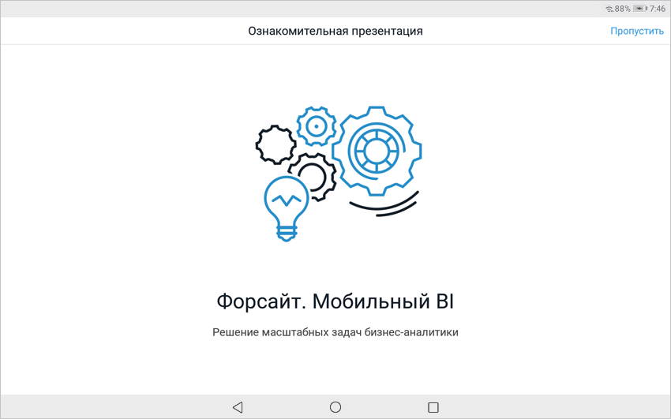
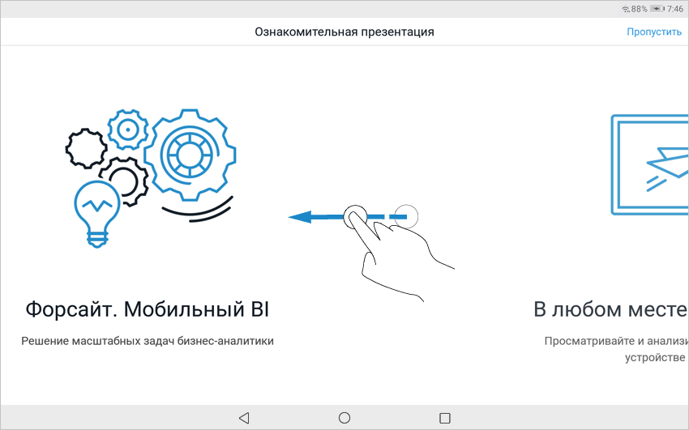
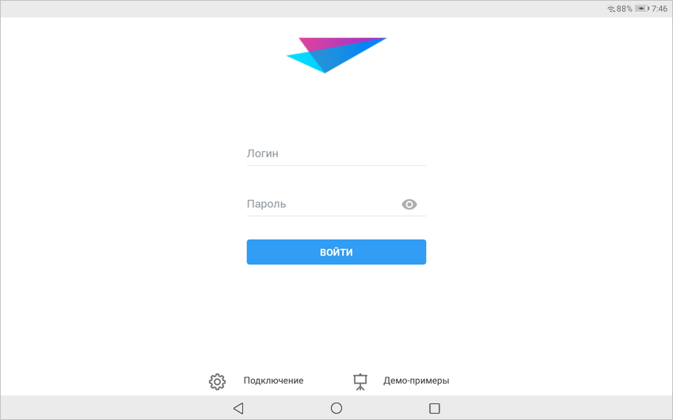
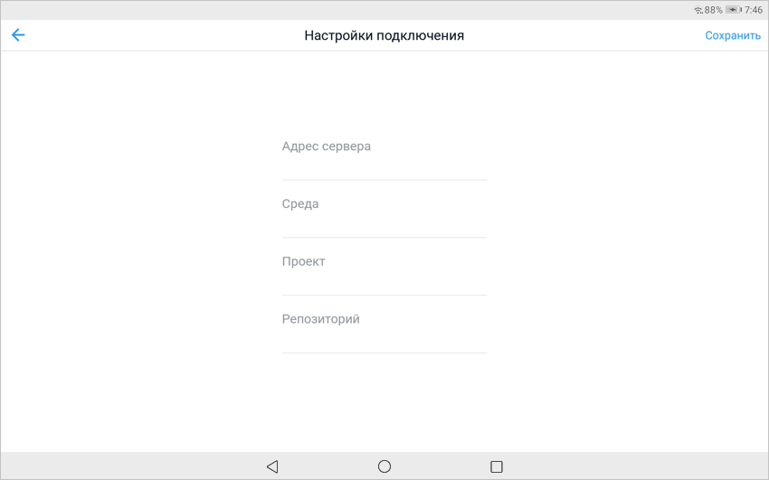

# Начало работы с мобильным приложением

Начало работы с мобильным приложением
-

# Начало работы с мобильным приложением

Для начала работы с мобильным приложением «Форсайт. Мобильный BI»:

	- Подключите [источники данных](Mobile_Platform_Server.htm)
	 на сервере мобильной платформы.

Примечание.
 Для подключения источников данных на сервере мобильной платформы и дальнейшей
 настройки подключения мобильного приложения к [репозиторию](GetStarted.chm::/GetStarted/Repository.htm)
 продукта «[Форсайт. Аналитическая платформа](GetStarted.chm::/Intro/PurposeMainFeatures.htm)»
 установите продукт «[Форсайт. Мобильная платформа](MobilePlatform.chm::/Installation/MobilePlatform_Setup.htm)». Аутентификация пользователей
 выполняется через сервер мобильной платформы. Настройка пользователей
 API и подключение к источнику данных осуществляется в [консоли администратора](MobilePlatform.chm::/Admin/Administration.htm).

	- Установите [мобильное
	 приложение](Setup.chm::/Setup_TitlePage.htm#mobile).

	- Запустите мобильное приложение «Форсайт BI».

Примечание.
 Проверьте подключение к сети Интернет для работы мобильного приложения.

	- Ознакомьтесь с [презентацией](Get_started_mobile.htm#presentation)
	 о ключевых возможностях мобильного приложения.

	- Посмотрите [демо-примеры](Demo_examples.htm) с готовыми
	 отчётами инструментов продукта «Форсайт. Аналитическая платформа».

	- Настройте [подключение](Get_started_mobile.htm#connection)
	 к серверу мобильной платформы в мобильном приложении и войдите в систему.

После выполнения действий будет открыт [навигатор
 объектов](../Navigator/Navigator.htm) при успешном входе в систему.

Примечание.
 Перед построением отчётов и аналитических панелей в настольном приложении
 ознакомьтесь с [рекомендациями по построению
 отчётов и аналитических панелей](Recommendations.htm) для корректного отображения на планшете.

## Ознакомительная презентация

При запуске мобильного приложения отображается название продукта «Форсайт. Аналитическая платформа»
 и открывается ознакомительная презентация, состоящая из последовательно
 отображаемых ключевых возможностей мобильного приложения:

Для перехода между слайдами проведите пальцем
 справа налево и наоборот. После перехода от первого слайда доступна прокрутка
 слайдов вперёд и назад до последнего.

Для пропуска ознакомительной презентации нажмите
 кнопку «Пропустить». Посмотрите
 [демо-примеры](Demo_examples.htm) при необходимости, настройте
 [подключение](Get_started_mobile.htm#connection) к серверу
 мобильной платформы и войдите в систему.

Для отключения ознакомительной презентации
 при запуске мобильного приложения снимите флажок напротив параметра «Ознакомительная презентация» в [настройках приложения](../Navigator/Navigator.htm#setting)
 при просмотре [демо-примеров](Demo_examples.htm) или в [навигаторе
 объектов](../Navigator/Navigator.htm).

## Настройки подключения и вход в систему

После просмотра [ознакомительной
 презентации](Get_started_mobile.htm#presentation) настройте подключение к серверу мобильной платформы и
 войдите в систему через экран регистрации:

Для настройки подключения к серверу мобильной платформы в мобильном
 приложении:

	- Нажмите кнопку «Подключение».

После выполнения действия будут отображены
 параметры подключения:

	- Задайте параметры:

		- Адрес сервера. Задайте
		 адрес сервера, на котором [установлен
		 продукт «Форсайт. Мобильная платформа»](MobilePlatform.chm::/Installation/MobilePlatform_Setup.htm);

		- Среда. Введите название
		 [среды](MobilePlatform.chm::/Admin/Projects/Environments_and_projects.htm),
		 в котором содержится проект с настроенным подключением к источнику
		 данных «Foresight Web».
		 По умолчанию задана среда «Foresight_app»;

		- Проект. Введите
		 название [проекта](MobilePlatform.chm::/Admin/Projects/Project.htm),
		 в котором настроено подключение к источнику данных «Foresight
		 Web». По умолчанию задан проект «Foresight_app»;

		- Репозиторий. Введите
		 идентификатор репозитория, к которому задано подключение в [настройках](MobilePlatform.chm::/Admin/Projects/DataSources_connection.htm#fsight)
		 источника данных.

	- Нажмите кнопку «Сохранить».

После выполнения действий будет настроено подключение к серверу мобильной
 платформы.

Для входа в систему:

	- Введите логин и пароль пользователя на экране регистрации. Убедитесь,
	 что учетные данные соответствуют заданным параметрам [пользователя
	 API](MobilePlatform.chm::/Admin/Projects/Users_API.htm#add_user) в консоли администратора мобильной платформы.

	- Нажмите кнопку «Войти».

После выполнения действий будет выполнена проверка соединения с сервером
 мобильной платформы и аутентификация учетной записи пользователя. При
 успешном выполнении проверки и аутентификации откроется [навигатор
 объектов](../Navigator/Navigator.htm).

См.
 также:

[Мобильное
 приложение на основе продукта «Форсайт. Мобильная платформа»](../Mobile_app.htm)
 | [Подключение источников данных на
 сервере мобильной платформы](Mobile_Platform_Server.htm) | [Просмотр
 демо-примеров](Demo_examples.htm) | [Работа с навигатором
 объектов](../Navigator/Navigator.htm)

		Справочная
		 система на версию 10.9
		 от 18/08/2025,
		 © ООО «ФОРСАЙТ»,
