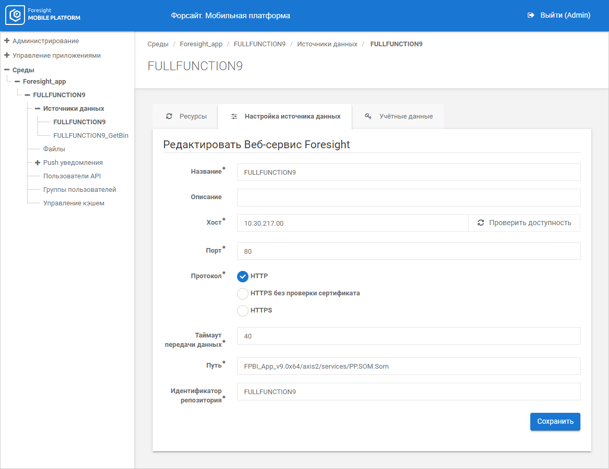
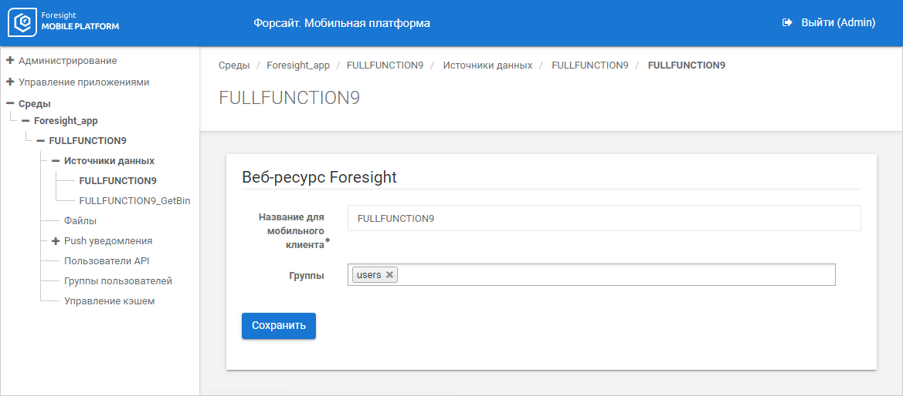
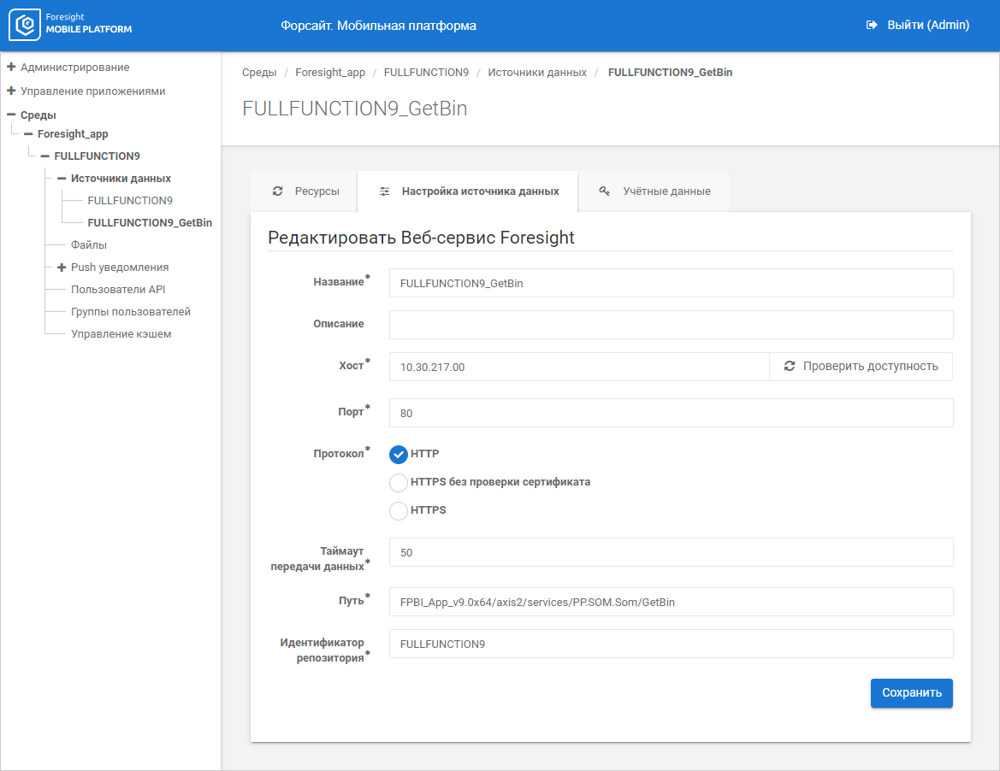

# Подключение источников данных на сервере мобильной платформы

Подключение источников данных на сервере мобильной платформы
-

# Подключение источников данных на сервере мобильной платформы

Для работы мобильного приложения настройте подключение к серверу продукта
 «Форсайт. Аналитическая платформа»
 на сервере мобильной платформы:

	- Убедитесь, что установлен [BI-сервер](Setup.chm::/UiWebSetup/UiWebSetup_TitlePage.htm)
	 продукта «Форсайт. Аналитическая платформа».

	- Откройте [консоль
	 администратора](MobilePlatform.chm::/Admin/Administration.htm#open) мобильной платформы.

	- Добавьте «Foresight Web»
	 в качестве [источника
	 данных](MobilePlatform.chm::/Admin/Projects/DataSources_and_Resources.htm) выбранного проекта и настройте [подключение](MobilePlatform.chm::/Admin/Projects/DataSources_connection.htm#fsight)
	 к серверу продукта «Форсайт. Аналитическая платформа»,
	 например:

	- Импортируйте [ресурс](MobilePlatform.chm::/Admin/Projects/Resource_import.htm#fp)
	 источника данных.

Примечание.
 При импорте ресурса значение в поле «Название
 для мобильного клиента» должно совпадать с идентификатором репозитория.

	- Добавьте второй [источник
	 данных](MobilePlatform.chm::/Admin/Projects/DataSources_and_Resources.htm) «Foresight
	 Web» для корректного отображения карт и экспорта данных в мобильном
	 приложении. Настройте [подключение](MobilePlatform.chm::/Admin/Projects/DataSources_connection.htm#fsight)
	 к серверу продукта «Форсайт. Аналитическая платформа»
	 в соответствии с условиями:

		- название источника данных задается в виде: <название
		 первого источника данных>_GetBin;

		- путь до веб-сервиса [PP.SOM.Som](PPSOMService.chm::/Intro/PP7Service_Using.htm)
		 задается в виде: <путь до
		 веб-сервиса>/GetBin.

	- Импортируйте [ресурс](MobilePlatform.chm::/Admin/Projects/Resource_import.htm#fp)
	 источника данных. В поле «Название
	 для мобильного клиента» задайте название ресурса в виде: <идентификатор репозитория>_GetBin.

После выполнения действий на сервере мобильной платформы будет настроено
 подключение к серверу продукта «Форсайт. Аналитическая платформа».
 Настройте [подключение](Get_started_mobile.htm#connection)
 к серверу мобильной платформы в мобильном приложении и войдите в систему.

См.
 также:

[Мобильное
 приложение на основе продукта «Форсайт. Мобильная платформа»](../Mobile_app.htm)
 | [Начало работы с мобильным приложением](Get_started_mobile.htm)

		Справочная
		 система на версию 10.9
		 от 18/08/2025,
		 © ООО «ФОРСАЙТ»,
