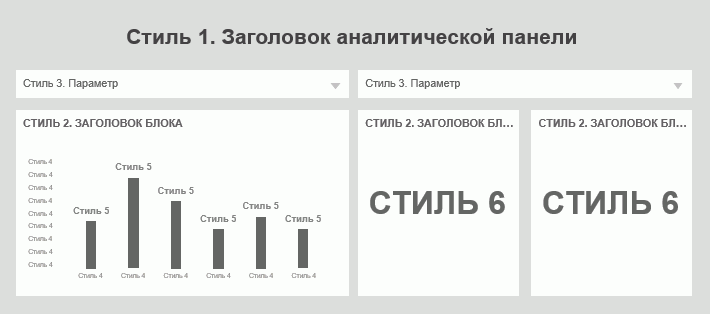
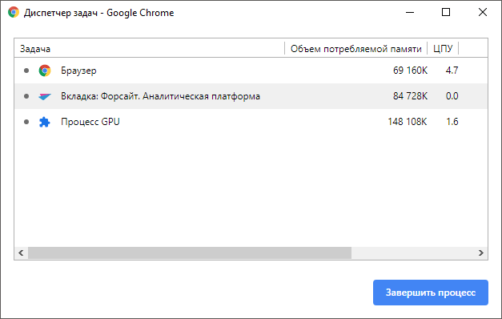

# Рекомендации по построению отчётов и аналитических панелей

Рекомендации по построению отчётов и аналитических панелей
-

# Рекомендации по построению отчётов и аналитических панелей

Для корректного отображения отчётов и аналитических панелей на планшетах
 настройте оформление в настольном приложении с учетом рекомендаций по
 построению отчётов и аналитических панелей.

Примечание.
 Отображение отчёта и аналитической панели с настроенным оформлением для
 мобильного приложения может отличаться при просмотре в веб-приложении.

В зависимости от вариантов оформления создайте несколько копий отчётов
 и аналитических панелей в [навигаторе
 объектов](GetStarted.chm::/Interface/Interface_Navigator.htm).

Настройте оформление в копии отчёта или аналитической панели:

	- [выберите
	 шрифт и настройте текстовые стили](Recommendations.htm#text);

	- [настройте
	 отображение визуализаторов](Recommendations.htm#visualizers).

После выполнения действий рассчитайте объем используемой [оперативной
 памяти](Recommendations.htm#ram) и проверьте отображение настроенного оформления на планшетах
 с операционной системой iOS и Android.

## Выбор шрифта и настройка текстовых стилей

Для одинакового отображения шрифтов при просмотре отчёта и аналитической
 панели в настольном и мобильном приложении выберите шрифты, аналоги которых
 доступны на планшетах с операционной системой iOS и Android.
 По умолчанию используется шрифт Tahoma и корректно отображается
 только на планшетах с операционной системой Android. На планшетах с операционной
 системой iOS шрифт меняется c Tahoma на Times New Roman.

Совет. Используйте
 шрифты: Arial, Trebuchet MS.

Совокупность элементов оформления текста (параметры шрифта, абзаца,
 заливки и другие элементы) определяет текстовый стиль. При настройке оформления
 текста используйте от 5 до 8 стилей.

Для корректного отображения блоков аналитической панели настройте текстовые
 стили:

	- заголовок аналитической панели.
	 Удалите блок с заголовком аналитической панели и переименуйте аналитическую
	 панель в навигаторе объектов в соответствии с необходимым заголовком
	 для уменьшения размера заголовка на экране планшета. При просмотре
	 аналитической панели заголовок будет отображаться на [панели
	 навигации](../Navigator/Dashboards.htm);

	- заголовок блока. Настройте
	 размещение каждого [заголовка блока](uiadhoc.chm::/document/block_caption.htm) аналитической панели в одну строку, сверху
	 или снизу с выравниванием текста по центру или по левому краю;

	- основной текст. Настройте
	 оформление основного текста и [интерактивных элементов
	 управления](UiAdhoc.chm::/Blocks/Controls/Controls.htm);

	- вспомогательный текст.
	 Настройте оформление подписей осей, легенды, подсказок и другого вспомогательного
	 текста. Размер шрифта текста должен быть меньше или равен размеру
	 основного текста;

	- подписи данных. Измените
	 размер шрифта [подписей данных](UiDiagrams.chm::/Property_diagramm/UiDiagrams_PropertyDiagramm_Label.htm)
	 диаграммы для отображения всех значений. Настройте положение подписей
	 так, чтобы значения не перекрывали друг друга;

	- индикатор. Измените
	 размер шрифта подписей [индикатора](UiAdhoc.chm::/Blocks/Gadgets/Indicator.htm)
	 для полного отображения числовых значений.

### Пример

В таблице приведены рекомендуемые значения параметров на основе шрифтов
 Arial и Trebuchet MS:

		 Название стиля
		 Описание
		 Размер шрифта, pt
		 Начертание
		 RGB цвет

		 Стиль 1

		 Заголовок аналитической панели

		 12 - 18

20 - 22
		 Полужирный

Обычный
		 65 65 65

76 76 76

		 Стиль 2
		 Заголовок блока
		 9 - 11
		 Полужирный

Полужирный + Caps Lock
		 76 76 76

102 102 102

		 Стиль 3
		 Основной текст
		 6 - 10
		 Обычный
		 76 76 76

102 102 102

		 Стиль 4
		 Вспомогательный текст
		 6 - 10
		 Обычный
		 145 143 141

		 Стиль 5
		 Подписи данных
		 8 - 11
		 Полужирный
		 76 76 76

102 102 102

		 Стиль 6
		 Индикатор
		 22 - 32
		 Полужирный
		 76 76 76

Схема распределения стилей:

## Настройка отображения визуализаторов

Для корректного отображения диаграмм:

	- установите флажок «[Автоматическое размещение](UiDiagrams.chm::/Tuning_format/uidiagrams_tuning_construction_area_digramm.htm#position)»
	 для автоматического размещения [области
	 построения](UiDiagrams.chm::/Tuning_format/uidiagrams_tuning_construction_area_digramm.htm) внутри диаграммы. Область построения
	 будет размещаться по центру диаграммы и автоматически менять размер
	 при изменении размеров диаграммы;

	- используйте [масштабирование
	 значений](UiDiagrams.chm::/Params_diagram/UiDiagrams_Axis.htm#zoom) до десятых или сотых. Многозначное число
	 будет преобразовано в компактное значение, например, число 1653212436
	 преобразуется в 1,65 млрд. Также заданное масштабирование используйте
	 в [заголовке
	 блока](uiadhoc.chm::/document/block_caption.htm) или в [подписях
	 данных](UiDiagrams.chm::/Property_diagramm/UiDiagrams_PropertyDiagramm_Label.htm);

	- задайте [формат
	 значений](UiDiagrams.chm::/Params_diagram/UiDiagrams_Axis.htm#axis_format), например,
	 для чисел - числовой формат с использованием разделителя группы
	 разрядов, для процентов - процентный, или вручную используйте пробелы
	 между разрядами, знаки процентов и другие единицы измерения;

	- используйте [линии
	 сетки](UiDiagrams.chm::/Params_diagram/UiDiagrams_Axis.htm#gridlines) по оси значений Y или по оси категорий X:

		- при использовании оси X задайте количество от 5 до 7;

		- при использовании оси Y задайте количество равное количеству
		 категорий.

Совет.
 Задайте RGB цвет линий 230 230 230 при использовании белого фона диаграммы.

	- вынесите [подписи
	 данных](UiDiagrams.chm::/Property_diagramm/UiDiagrams_PropertyDiagramm_Label.htm) за область построения для удобного отображения
	 данных диаграммы;

	- разместите [легенду](UiDiagrams.chm::/Property_diagramm/UiDiagrams_PropertyDiagramm_legend.htm)
	 снизу по центру. Оформление легенд в рамках одной аналитической панели
	 должно быть одинаковое.

После выполнения действий диаграммы в отчёте и аналитической панели
 будут корректно отображаться на планшете.

Для просмотра объектов наблюдения визуализаторов в определенный промежуток
 времени используйте один отмеченный элемент календарного измерения. Динамика
 изменения объектов наблюдения с помощью временной шкалы используется для
 презентации отчётов и аналитических панелей в настольном и веб-приложении,
 и не актуальна для просмотра на планшете.

## Расчёт оперативной памяти

При построении отчётов и аналитических панелей для планшетов учитывайте
 объем оперативной памяти, который использует отчёт или аналитическая панель.
 Для просмотра отчётов на планшете используйте не более 80% от объема оперативной
 памяти планшета. Например, планшет содержит 1Гб оперативной памяти, из
 которых 800Мб занимает мобильное приложение.

Для расчёта используемого объема оперативной памяти:

	- Откройте отчёт или аналитическую панель в [веб-приложении](Setup.chm::/UiWebSetup/03_setup_web/opening_web_application.htm).

	- Откройте окно «Диспетчер задач»
	 в браузере с помощью сочетания клавиш SHIFT+ESC.

Примечание.
 Используйте [браузер](Setup.chm::/03_DB_Server_Config/Setup_DB_ServerSysReq.htm#client),
 поддерживающий диспетчер задач.

Например, диспетчер задач в браузере [Google Chrome](https://www.google.ru/chrome/):

После выполнения действий суммируйте объем потребляемой памяти вкладки
 с открытым отчётом и объем памяти процесса GPU. Сумма объема потребляемой
 памяти не должна превышать 80% от объема оперативной памяти планшета.

См.
 также:

[Мобильное
 приложение на основе продукта «Форсайт. Мобильная платформа»](../Mobile_app.htm)
 | [Просмотр аналитических панелей](../Navigator/Dashboards.htm)

		Справочная
		 система на версию 10.9
		 от 18/08/2025,
		 © ООО «ФОРСАЙТ»,
