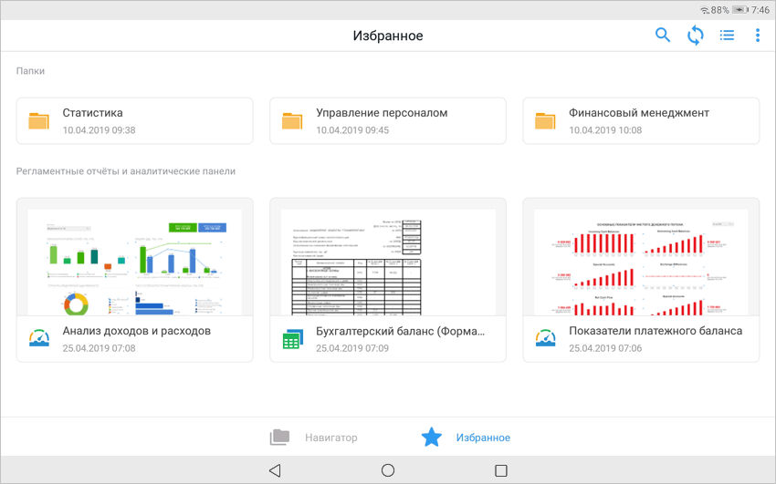

# Мобильное приложение

Мобильное приложение
-

# Мобильное приложение «Форсайт. Мобильный BI»

Мобильное приложение «Форсайт. Мобильный BI» позволяет
 анализировать данные с помощью интерактивных взаимосвязанных визуализаторов
 и просматривать отчёты на печать на планшете. Приложение реализовано на
 основе продукта «[Форсайт. Мобильная платформа](MobilePlatform.chm::/Introduction/MobilePlatform_Intro.htm)»
 для планшетов с операционной системой iOS или Android и доступно для скачивания
 на сайте магазина App Store и Google Play.

В настольном и веб-приложении продукта «[Форсайт. Аналитическая платформа](GetStarted.chm::/Intro/PurposeMainFeatures.htm)»
 анализ данных и построение отчётов выполняется с помощью различных инструментов.
 Отчёты, построенные с помощью инструментов «Аналитические
 панели» и «Отчёты», доступны
 для просмотра в мобильном приложении «Форсайт. Мобильный BI». Настройки,
 заданные при построении отчётов в настольном или веб-приложении, автоматически
 обновляются в репозитории на планшете. Подключение к репозиторию осуществляется
 с помощью продукта «[Форсайт. Мобильная платформа](MobilePlatform.chm::/Introduction/MobilePlatform_Intro.htm)».

Ключевые возможности:

	- автоматическая загрузка объектов в мобильное приложение, даже
	 если они создаются в настольном или веб-приложении;

	- обновление объектов;

	- формирование избранных объектов;

	- отображение объектов в том виде, к которому они были приведены
	 в настольном приложении;

	- просмотр аналитических панелей и отчётов для печати;

	- открытие аналитических панелей и отчётов в формате PDF (*.pdf),
	 PPTX (*.pptx), XLSX (*.xlsx).

Для начала работы с мобильным приложением обратитесь к разделу «[Начало
 работы с мобильным приложением](Get_started/Get_started_mobile.htm)».

		Справочная
		 система на версию 10.9
		 от 18/08/2025,
		 © ООО «ФОРСАЙТ»,
