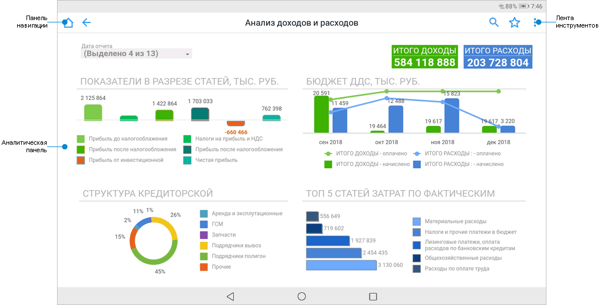
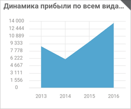

# Просмотр аналитических панелей

Просмотр аналитических панелей
-

# Просмотр аналитических панелей

Аналитическая панель, построенная с помощью инструмента «[Аналитические
 панели](UIAdhoc.chm::/UiAdhoc_Purpose.htm)» в настольном или веб-приложении, позволяет
 просматривать сформированные аналитические документы в виде комбинации
 интерактивных взаимосвязанных [визуализаторов](DataAnalysis.chm::/Visualizators.htm).

Примечание.
 Перед построением аналитических панелей в настольном приложении ознакомьтесь
 с [рекомендациями по построению
 аналитических панелей](../Get_started/Recommendations.htm) для корректного отображения на планшете.

Для просмотра аналитической панели выберите аналитическую панель в [навигаторе объектов](Navigator.htm). После выполнения действия
 будет открыта аналитическая панель:

[Элементы
 аналитической панели](javascript:TextPopup(this))

		- Панель навигации.
		 Содержит наименование аналитической панели, кнопку  «Назад»
		 для навигации к предыдущей директории и кнопку 
		 «Домой» для открытия корневой
		 директории навигатора объектов. Домашнюю страницу можно выбрать
		 в [настройках приложения](Navigator.htm#setting);

		- Лента инструментов.
		 Содержит кнопки для работы с аналитической панелью;

		- Аналитическая панель.
		 Содержит взаимосвязанные визуализаторы, отчёты, интерактивные
		 элементы управления и другие объекты.

## Работа с аналитической панелью

[Поиск
 данных](javascript:TextPopup(this))

	Для поиска данных в аналитической панели:

		- Нажмите кнопку .

	После выполнения действия будет отображена
	 строка поиска:

	

		- Введите искомое слово частично или полностью.

	После выполнения действий будут выделены соответствующие слова.

	Для сброса поиска нажмите  в строке поиска.

[Добавление
 аналитической панели в избранное](javascript:TextPopup(this))

	Для добавления аналитической панели в избранное нажмите кнопку .

	После выполнения действия аналитическая панель будет добавлена в
	 избранное и на экране отобразится соответствующее сообщение. Избранные
	 объекты доступны на вкладке «Избранное»
	 в [навигаторе объектов](Navigator.htm).

[Открытие
 аналитической панели в других форматах](javascript:TextPopup(this))

	Для открытия аналитической панели в формате PDF (*.pdf), PPTX (*.pptx),
	 XLSX (*.xlsx):

		- Нажмите кнопку «Открыть
		 в» в раскрывающемся меню кнопки .

	После выполнения действия будет открыто
	 окно выбора формата:

	

		- Выберите формат, в котором будет открыта аналитическая панель:

			- PDF (*.pdf);

			- PPTX (*.pptx);

			- XLSX (*.xlsx).

	После выполнения действий аналитическая панель будет открыта в выбранном
	 формате.

[Изменение
 параметров аналитической панели](javascript:TextPopup(this))

	Для изменения общих параметров аналитической панели или отдельного
	 визуализатора:

		- Нажмите кнопку .

	После выполнения действия будет открыто
	 окно с параметрами, например:

	

		- Задайте параметры, по которым будет отображаться аналитическая
		 панель или отдельный визуализатор.

	После выполнения действий аналитическая панель или отдельный визуализатор
	 будет отображаться по заданным параметрам.

Примечание.
 Отображение аналитической панели и работа с визуализаторами зависит от
 заданных настроек при [построении
 аналитической панели](UIAdhoc.chm::/Document/Work.htm)
 в настольном или веб-приложении продукта «Форсайт. Аналитическая платформа».

Для смены репозитория нажмите кнопку «Выйти» в раскрывающемся меню кнопки
 .
 После выполнения действия будет открыт [экран
 регистрации](../Get_started/Get_started_mobile.htm#connection).

## Просмотр объекта на полном экране

Для просмотра объекта на полном экране:

	- Нажмите на уголок в правом верхнем углу блока:

	- Нажмите кнопку .

После выполнения действий выбранный объект будет отображен на полном
 экране.

Для сворачивания объекта к исходному размеру:

	- Нажмите на уголок в правом верхнем углу блока.

	- Нажмите кнопку .

После выполнения действий объект будет отображаться на аналитической
 панели в исходном размере.

## Визуализаторы данных

В аналитической панели поддерживаются взаимосвязанные визуализаторы:
 «[Таблица](UiAnalyticalArea.chm::/Table.htm)»,
 «[Диаграмма](UiDiagrams.chm::/Diagrams.htm)»,
 «[Карта](UiMaps.chm::/Map.htm)», «[Пузырьковая
 диаграмма](UiVisualizators.chm::/BubbleChart/BubbleChart.htm)», «[Пузырьковое
 дерево](UiVisualizators.chm::/BubbleTree/BubbleTree.htm)», «[Плоское дерево](UiVisualizators.chm::/TreeMap/TreeMap.htm)».

Для удобной работы с визуализатором данных [разверните
 объект](Dashboards.htm#view) на полный экран.

Примечание.
 Визуализаторы отображаются в зависимости от настроек, заданных при [построении аналитической панели](UIAdhoc.chm::/Document/Work.htm)
 в настольном или веб-приложении, и [прав доступа](UiNav.chm::/02_Navigator/UiNav_PrDo.htm)
 пользователя.

Работа с визуализаторами:

[Отображение
 всплывающей подсказки](javascript:TextPopup(this))

	Для отображения всплывающей подсказки нажмите на элемент визуализатора.
	 Всплывающая подсказка содержит дополнительные сведения элемента визуализатора.

[Детализация
 и обобщение данных](javascript:TextPopup(this))

	Детализация и обобщение данных позволяют анализировать данные на
	 разных уровнях: от общих к частным и наоборот. Доступная глубина детализации
	 определяется иерархией измерений источника данных.

	Для детализации данных:

		- Зажмите элемент визуализатора.

		- Выполните команду «Детализировать»
		 в контекстном меню выбранного элемента.

	После выполнения действий будет выполнен переход на уровень
	 выбранного элемента с подробным содержанием.

	Для обобщения данных:

		- Зажмите элемент визуализатора.

		- Выполните команду «Обобщить»
		 в контекстном меню выбранного элемента.

	После выполнения действий будет выполнен переход на уровень общей
	 информации, в которой содержится выбранный элемент.

	Для получения подробной информации о детализации и обобщении данных
	 обратитесь к разделу соответствующего визуализатора: [таблица](UiAnalyticalArea.chm::/Working_with_table_data/Drill_down.htm),
	 [диаграмма](UiDiagrams.chm::/Working_with_data/Series_drill_down.htm),
	 [карта](UiMaps.chm::/Configure/Advanced_Features.htm#drilldown),
	 [пузырьковая
	 диаграмма](UiVisualizators.chm::/BubbleChart/BubbleChart.htm#drilldown), [пузырьковое
	 дерево](UiVisualizators.chm::/BubbleTree/BubbleTree.htm#drill), [плоское дерево](UiVisualizators.chm::/TreeMap/TreeMap.htm#drill).

[Исключение
 данных](javascript:TextPopup(this))

	Для исключения данных визуализатора:

		- Зажмите элемент визуализатора или заголовок строки/столбца
		 таблицы, который необходимо исключить.

		- Выполните команду «Исключить»
		 в контекстном меню элемента.

	После выполнения действий будет исключен элемент визуализатора или
	 строка/столбец таблицы.

	Для исключения всех данных визуализатора, кроме выделенных:

		- Зажмите элемент визуализатора или ячейку, заголовок строки/столбца
		 таблицы, данные которого должны отображаться в визуализаторе.

		- Выполните команду «Исключить
		 остальные» в контекстном меню элемента.

	После выполнения действий будут исключены все данные визуализатора,
	 кроме данных выделенного элемента.

	Для получения подробной информации об исключении данных обратитесь
	 к разделу соответствующего визуализатора: [таблица](UiAnalyticalArea.chm::/Working_with_table_data/Delete_data.htm),
	 [диаграмма](UiDiagrams.chm::/Working_with_data/Excluding_Series_from_Chart.htm),
	 [карта](UiMaps.chm::/Configure/Advanced_Features.htm#exclude).

[Просмотр
 статистических характеристик](javascript:TextPopup(this))

	Таблица данных позволяет отображать статистические характеристики,
	 вычисленные для выбранных диапазонов таблицы. Набор рассчитываемых
	 характеристик зависит от значений в выбранном диапазоне.

	Примечание.
	 Просмотр статистических характеристик доступен только для визуализатора
	 «Таблица».

	Для просмотра статистических характеристик:

		- Зажмите ячейку, заголовок строки/столбца.

		- Выполните команду «Статистические
		 характеристики» в контекстном меню выделенной ячейки.

	После выполнения действий будет открыто окно «Статистические
	 характеристики»:

	

	Для получения подробной информации о просмотре статистических характеристик
	 обратитесь к разделу «[Статистические
	 характеристики](UiAnalyticalArea.chm::/Analysis/Statistics.htm)».

См.
 также:

[Мобильное
 приложение на основе продукта «Форсайт. Мобильная платформа»](../Mobile_app.htm)
 | [Рекомендации по построению
 отчётов и аналитических панелей](../Get_started/Recommendations.htm) | [Работа с
 навигатором объектов](Navigator.htm) | [Просмотр отчётов на печать](Report.htm)

		Справочная
		 система на версию 10.9
		 от 18/08/2025,
		 © ООО «ФОРСАЙТ»,
