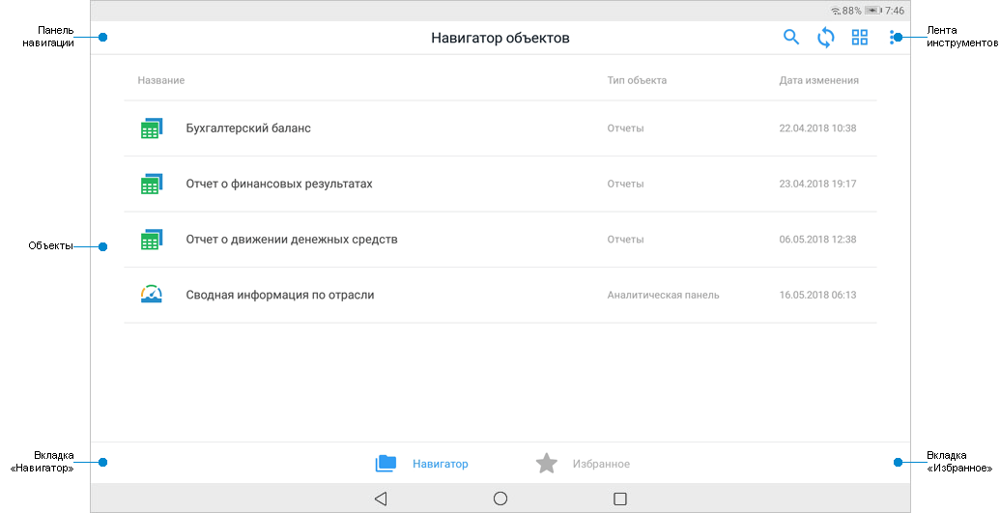
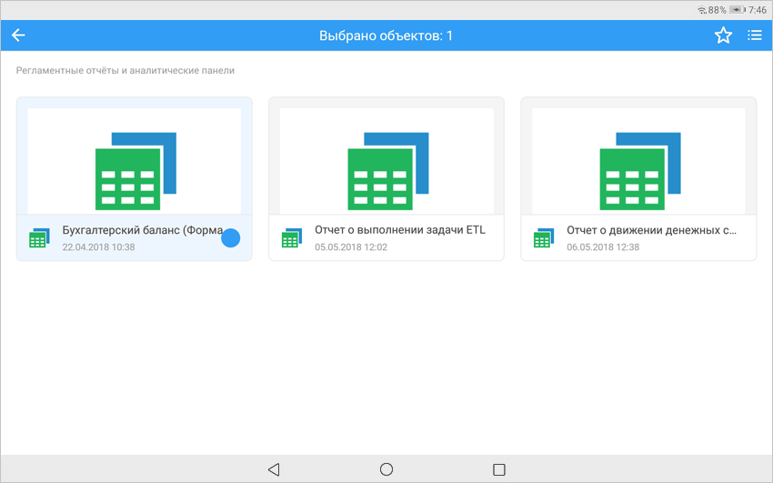
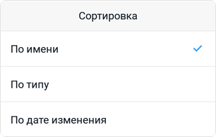
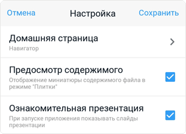

# Работа с навигатором объектов

Работа с навигатором объектов
-

# Работа с навигатором объектов

Навигатор объектов – это инструмент для визуального представления репозитория,
 в котором содержатся объекты типа: «Папка», «Аналитическая панель», «Регламентный
 отчёт». Все объекты отображаются аналогично объектам в [веб-приложении](GetStarted.chm::/GetStarted/Get_Started.htm)
 и автоматически загружаются в репозиторий при создании в настольном или
 веб-приложении.

Для открытия навигатора объектов [войдите
 в систему](../Get_started/Get_started_mobile.htm#connection). После выполнения действия будет открыт навигатор объектов:

[Элементы
 навигатора](javascript:TextPopup(this))

		- Панель навигации.
		 Содержит наименование текущей директории, кнопку  «Назад»
		 для навигации к предыдущей директории и кнопку 
		 «Домой» для открытия корневой
		 директории навигатора объектов. Домашнюю страницу можно выбрать
		 в [настройках приложения](Navigator.htm#setting);

		- Лента инструментов.
		 Содержит кнопки для работы с объектами;

		- Объекты. Содержит
		 объекты текущей директории. Отображение объектов зависит от выбранного
		 [вида отображения](Navigator.htm#view);

		- Вкладка «Навигатор».
		 Содержит все объекты репозитория;

		- Вкладка «Избранное».
		 Содержит только [избранные](Navigator.htm#favorites)
		 объекты репозитория.

Ключевые возможности:

	- обновление объектов;

	- формирование избранных объектов;

	- поиск и сортировка объектов;

	- изменение вида отображения объектов;

	- просмотр аналитических панелей и отчётов для печати;

	- настройка приложения.

Для смены репозитория или просмотра [демо-примеров](../Get_started/Demo_examples.htm)
 нажмите кнопку «Выйти» в раскрывающемся
 меню кнопки .
 После выполнения действия будет открыт [экран
 регистрации](../Get_started/Get_started_mobile.htm#connection).

## Работа с объектами навигатора

[Обновление
 объектов](javascript:TextPopup(this))

	Для обновления объектов навигатора нажмите кнопку .

	Примечание.
	 Обновление объектов навигатора недоступно при просмотре [демо-примеров](../Get_started/Demo_examples.htm).

[Добавление объекта в избранное](javascript:TextPopup(this))

	Для добавления объекта в избранное:

		- Выберите и зажмите объект, пока не появится меню выбранного
		 объекта:

	

		- Выберите несколько объектов при необходимости. Для удобного
		 выбора объектов можно изменить [вид
		 отображения](Navigator.htm#view).

		- Нажмите кнопку .

	После выполнения действий выбранные объекты будут добавлены в избранное
	 и на экране отобразится соответствующее сообщение. Избранные объекты
	 доступны на вкладке «Избранное»
	 в навигаторе объектов.

	Примечание.
	 Добавление объектов в избранное доступно только после [входа
	 в систему](../Get_started/Get_started_mobile.htm#connection).

[Поиск
 объекта](javascript:TextPopup(this))

	Для поиска объекта в навигаторе:

		- Нажмите кнопку .

	После выполнения действия будет отображена
	 строка поиска:

	

		- Введите название объекта частично или полностью.

	После выполнения действий будут найдены соответствующие объекты.

	Для сброса поиска нажмите  в строке поиска.

[Сортировка
 объектов](javascript:TextPopup(this))

	Для сортировки объектов:

		- Нажмите кнопку «Сортировка»
		 в раскрывающемся меню кнопки .

	После выполнения действия будет открыто
	 окно сортировки:

	

		- Выберите сортировку:

			- По имени. Объекты
			 сортируются в зависимости от наименования по алфавиту;

			- По типу. Объекты
			 сортируются по папкам, аналитическим панелям и регламентным
			 отчётам;

			- По дате изменения.
			 Объекты сортируются по дате изменения от текущей даты.

	Примечание.
	 Папки сортируются отдельно от объектов типа «Аналитическая панель»,
	 «Регламентный отчёт».

	После выполнения действий объекты будут отсортированы.

[Изменение
 вида отображения объектов](javascript:TextPopup(this))

	Для изменения вида отображения объектов нажмите кнопку:

		- .
		 Отображение объектов в виде списка;

		- .
		 Отображение объектов в виде плиток. В режиме отображения объектов
		 в виде плиток доступен предпросмотр содержимого объекта. Для отключения
		 предпросмотра снимите флажок напротив параметра «Предпросмотр
		 содержимого» в [настройках
		 приложения](Navigator.htm#setting).

	Примечание.
	 Для отображения предварительного просмотра объектов установите флажок
	 «[Разрешить отображение объектов в виде значков
	 без учета прав доступа на объекты](admin.chm::/03_admin/access_control_settings.htm#extralargeicons)» в [менеджере безопасности](admin.chm::/admin_title.htm)
	 продукта «Форсайт. Аналитическая платформа».

## Настройка приложения

Для настройки приложения:

	- Нажмите кнопку «Настройка приложения»
	 в раскрывающемся меню кнопки .

После выполнения действия будет открыто окно
 настройки:

	- Выберите домашнюю страницу после нажатия на кнопку «Домашняя
	 страница»:

		- Навигатор. По умолчанию.
		 После входа в систему или при нажатии на кнопку  будет открыта корневая
		 директория навигатора объектов;

		- Избранное. После
		 входа в систему или при нажатии на кнопку 
		 будут открыты избранные объекты.

Примечание.
 Выбор домашней страницы доступен только после [входа
 в систему](../Get_started/Get_started_mobile.htm#connection).

	- Установите/снимите флажок напротив параметра:

		- Предпросмотр содержимого.
		 По умолчанию флажок снят. Предпросмотр содержимого объекта доступен
		 только при выбранном режиме отображения объектов в виде [плитки](Navigator.htm#view);

		- Ознакомительная презентация.
		 По умолчанию флажок установлен. [Ознакомительная
		 презентация](../Get_started/Get_started_mobile.htm#presentation) отображается при запуске мобильного приложения
		 и состоит из последовательно отображаемых ключевых возможностей.

	- Нажмите кнопку «Сохранить»
	 для сохранения изменений.

После выполнения действий будут изменены настройки приложения.

См.
 также:

[Мобильное
 приложение на основе продукта «Форсайт. Мобильная платформа»](../Mobile_app.htm)
 | [Просмотр аналитических панелей](Dashboards.htm) | [Просмотр
 отчётов для печати](Report.htm)

		Справочная
		 система на версию 10.9
		 от 18/08/2025,
		 © ООО «ФОРСАЙТ»,
