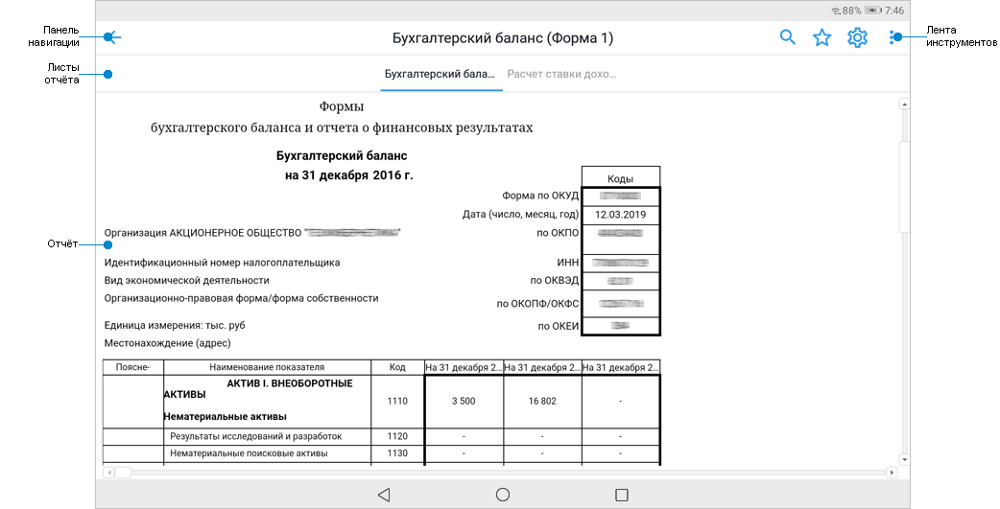
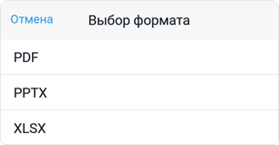
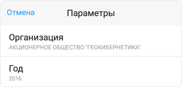
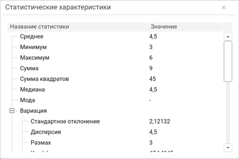

# Просмотр отчётов для печати

Просмотр отчётов для печати
-

# Просмотр отчётов для печати

Регламентные отчёты, построенные с помощью инструмента «[Отчёты](UIReport.chm::/UiReport_purpose.htm)»
 в настольном или веб-приложении, позволяют просматривать сформированные
 отчёты со сложным форматированием, предназначенные для печати.

Для просмотра отчёта под печать выберите отчёт в [навигаторе
 объектов](Navigator.htm). После выполнения действия будет открыт отчёт:

[Элементы
 регламентного отчёта](javascript:TextPopup(this))

		- Панель навигации.
		 Содержит наименование отчёта и кнопку  «Назад» для навигации к предыдущей
		 директории;

		- Лента инструментов.
		 Содержит кнопки для работы с отчётом;

		- Листы отчёта. Содержит
		 навигацию по листам отчёта;

		- Отчёт. Содержит
		 отчёт для печати.

## Работа с отчётом

[Поиск
 данных](javascript:TextPopup(this))

	Для поиска данных в отчёте:

		- Нажмите кнопку .

	После выполнения действия будет отображена
	 строка поиска:

	

		- Введите искомое слово частично или полностью.

	После выполнения действий будут выделены соответствующие ячейки
	 с искомыми словами.

	Для сброса поиска нажмите  в строке поиска.

[Добавление
 отчёта в избранное](javascript:TextPopup(this))

	Для добавления отчёта в избранное нажмите кнопку .

	После выполнения действия отчёт будет добавлен в избранное и на
	 экране отобразится соответствующее сообщение. Избранные объекты доступны
	 на вкладке «Избранное» в [навигаторе объектов](Navigator.htm).

[Открытие
 отчёта в других форматах](javascript:TextPopup(this))

	Для открытия отчёта в формате PDF (*.pdf), PPTX (*.pptx), XLSX (*.xlsx):

		- Нажмите кнопку «Открыть
		 в» в раскрывающемся меню кнопки .

	После выполнения действия будет открыто
	 окно выбора формата:

	

		- Выберите формат, в котором будет открыт отчёт:

			- PDF (*.pdf);

			- PPTX (*.pptx);

			- XLSX (*.xlsx).

	После выполнения действий отчёт будет открыт в выбранном формате.

[Изменение
 параметров отчёта](javascript:TextPopup(this))

	Для изменения параметров отчёта:

		- Нажмите кнопку .

	После выполнения действия будет открыто
	 окно с параметрами:

	

		- Задайте параметры, по котором будет отображаться срез данных
		 в отчёте.

	После выполнения действий в отчёте будет отображаться срез данных
	 по заданным параметрам.

[Детализация
 и обобщение данных](javascript:TextPopup(this))

	Детализация и обобщение данных позволяют анализировать данные на
	 разных уровнях: от общих к частным и наоборот. Доступная глубина детализации
	 определяется иерархией измерений источника данных.

	Для детализации данных:

		- Зажмите ячейку.

		- Выполните команду «Детализировать»
		 в контекстном меню выбранной ячейки.

	После выполнения действий будет выполнен переход на уровень
	 выбранного элемента с подробным содержанием.

	Для обобщения данных:

		- Зажмите ячейку.

		- Выполните команду «Обобщить»
		 в контекстном меню выбранной ячейки.

	После выполнения действий будет выполнен переход на уровень общей
	 информации, в которой содержится выбранный элемент.

	Для получения подробной информации о детализации и обобщении данных
	 таблицы обратитесь к разделу «[Детализация
	 и обобщение данных](UiAnalyticalArea.chm::/Working_with_table_data/Drill_down.htm)».

[Исключение
 данных из таблицы](javascript:TextPopup(this))

	Для исключения данных из таблицы:

		- Зажмите заголовок строки/столбца таблицы, который необходимо
		 исключить.

		- Выполните команду «Исключить»
		 в контекстном меню выделенной строки/столбца.

	После выполнения действий из таблицы будет исключена выделенная
	 строка/столбец.

	Для исключения всех данных из таблицы, кроме выделенных:

		- Зажмите ячейку или заголовок строки/столбца в таблице, данные
		 которых должны отображаться в таблице.

		- Выполните команду «Исключить
		 остальные» в контекстном меню выделенной ячейки или строки/столбца.

	После выполнения действий из таблицы будут исключены все данные,
	 кроме выделенных.

	Для получения подробной информации о просмотре статистических характеристик
	 обратитесь к разделу «[Исключение
	 данных из таблицы](UiAnalyticalArea.chm::/Working_with_table_data/Delete_data.htm)».

[Просмотр
 статистических характеристик](javascript:TextPopup(this))

	Таблица данных позволяет отображать статистические характеристики,
	 вычисленные для выбранных диапазонов таблицы. Набор рассчитываемых
	 характеристик зависит от значений в выбранном диапазоне.

	Для просмотра статистических характеристик:

		- Зажмите ячейку, заголовок строки/столбца.

		- Выполните команду «Статистические
		 характеристики» в контекстном меню выделенной ячейки.

	После выполнения действий будет открыто окно «Статистические
	 характеристики»:

	

	Для получения подробной информации о просмотре статистических характеристик
	 обратитесь к разделу «[Статистические
	 характеристики](UiAnalyticalArea.chm::/Analysis/Statistics.htm)».

Примечание.
 Работа с отчётом зависит от заданных настроек при построении отчёта в
 настольном или веб-приложении продукта «Форсайт. Аналитическая платформа».

Для смены репозитория нажмите кнопку «Выйти» в раскрывающемся меню кнопки
 .
 После выполнения действия будет открыт [экран
 регистрации](../Get_started/Get_started_mobile.htm#connection).

См.
 также:

[Мобильное
 приложение на основе продукта «Форсайт. Мобильная платформа»](../Mobile_app.htm)
 | [Работа с навигатором объектов](Navigator.htm) | [Просмотр
 аналитических панелей](Dashboards.htm)

		Справочная
		 система на версию 10.9
		 от 18/08/2025,
		 © ООО «ФОРСАЙТ»,
