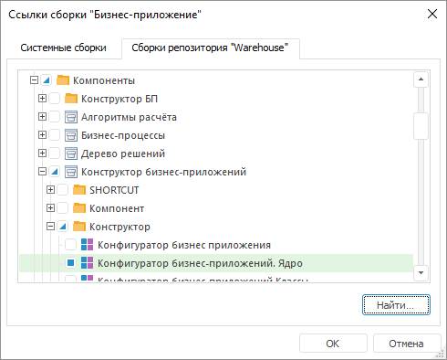
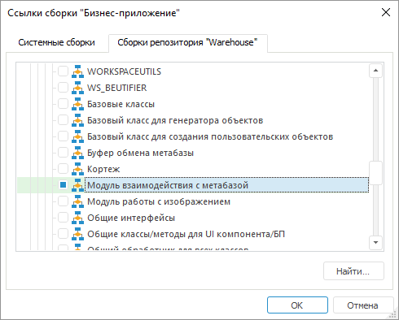

# Общие принципы программирования с использованием сборки DBA

Общие принципы программирования с использованием сборки DBA
-

# Общие принципы программирования с использованием сборки DBA

Сборка DBA предназначена для работы с расширением «[Бизнес-приложение](Constructor.chm::/Intro/Designer_business_applications.htm)».
 Программирование на Fore с
 использованием данной сборки заключается в последовательной настройке
 бизнес-процессов.

Перед началом работы с бизнес-приложением:

	- Убедитесь, что [установлено](Setup.chm::/Extensions/install_or_update_extensions.htm)
	 расширение «[Бизнес-приложение](Constructor.chm::/Intro/Designer_business_applications.htm)».

	- В среде разработки добавьте [ссылки](UiDevEnv.chm::/01_Development_Environment/03_Windows_of_Development_Environment/Inspector_assemblies.htm)
	 на системную сборку DBA, пользовательскую
	 сборку «Конфигуратор бизнес-приложений.
	 Ядро» и модуль «Модуль взаимодействия
	 с метабазой», которые содержится в компоненте «Алгоритмы
	 расчёта»:

См. также:

[Введение
 в сборку DBA](ModDBA_Introduction.htm) | [Интерфейсы
 сборки DBA](../Interface/ModDBA_Interface.htm) | [Классы сборки
 DBA](../Class/ModDBA_Class.htm.htm)

		Справочная
		 система на версию 10.9
		 от 18/08/2025,
		 © ООО «ФОРСАЙТ»,
