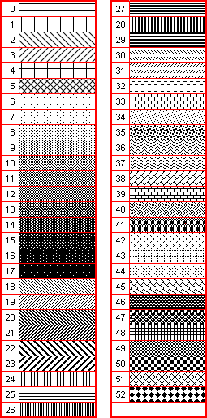

# GxHatchStyle

GxHatchStyle
-

# GxHatchStyle

## Описание

Перечисление GxHatchStyle содержит типы штриховки.

Используется следующим свойством:

-
[IGxHatchBrush.HatchStyle](../Interface/IGxHatchBrush/IGxHatchBrush.HatchStyle.htm).

## Допустимые значения

 Значение
 Краткое описание

 0
 Horizontal

 1
 Vertical

 2
 ForwardDiagonal

 3
 BackwardDiagonal

 4
 Cross

 5
 DiagonalCross

 6
 Percent05

 7
 Percent10

 8
 Percent20

 9
 Percent25

 10
 Percent30

 11
 Percent40

 12
 Percent50

 13
 Percent60

 14
 Percent70

 15
 Percent75

 16
 Percent80

 17
 Percent90

 18
 LightDownwardDiagonal

 19
 LightUpwardDiagonal

 20
 DarkDownwardDiagonal

 21
 DarkUpwardDiagonal

 22
 WideDownwardDiagonal

 23
 WideUpwardDiagonal

 24
 LightVertical

 25
 LightHorizontal

 26
 NarrowVertical

 27
 NarrowHorizontal

 28
 DarkVertical

 29
 DarkHorizontal

 30
 DashedDownwardDiagonal

 31
 DashedUpwardDiagonal

 32
 DashedHorizontal

 33
 DashedVertical

 34
 SmallConfetti

 35
 LargeConfetti

 36
 ZigZag

 37
 Wave

 38
 DiagonalBrick

 39
 HorizontalBrick

 40
 Weave

 41
 Plaid

 42
 Divot

 43
 DottedGrid

 44
 DottedDiamond

 45
 Shingle

 46
 Trellis

 47
 Sphere

 48
 SmallGrid

 49
 SmallCheckerBoard

 50
 LargeCheckerBoard

 51
 OutlinedDiamond

 52
 SolidDiamond

 53
 Total - данный тип штриховки не используется. Значение возвращает общее число доступных типов штриховки.

См. также:

[Перечисления сборки Drawing](ModDraving_Enums.htm)

		Справочная
		 система на версию 10.9
		 от 18/08/2025,
		 © ООО «ФОРСАЙТ»,
