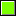
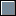
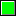
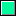

# GxKnownColor

GxKnownColor
-

# GxKnownColor

## Описание

Перечисление GxKnownColor содержит
 стандартные цвета, которые необходимо получить.

Используется следующим методом:

	- [IGxColorClass.FromKnownColor](../Interface/IGxColorClass/IGxColorClass.FromKnownColor.htm).

## Допустимые значения

		 Значение
		 Краткое описание

		 4293982463
		  AliceBlue.
		 Бледный светло-голубой.

		 4294634455
		  AntiqueWhite.
		 Бледно-желтый.

		 4286578644
		  Aquamarine.
		 Зеленовато-голубой.

		 4293984255
		  Azure.
		 Лазурный.

		 4294309340
		  Beige. Серовато-желтый.

		 4294960324
		  Bisque. Светло-коричневый.

		 4278190080
		  Black.
		 Черный.

		 4294962125
		  BlanchedAlmond.
		 Миндалевый.

		 4278190335
		  Blue. Синий.

		 4287245282
		  BlueViolet. Сине-фиолетовый.

		 4289014314
		  Brown.
		 Коричневый.

		 4292786311
		  BurlyWood.
		 Древесный.

		 4284456608
		  CadetBlue. Сине-зеленый.

		 4286578432
		  Chartreuse.
		 Зеленовато-желтый.

		 4291979550
		  Chocolate.
		 Шоколадный.

		 4294934352
		  Coral. Светло-красный,
		 коралловый.

		 4284782061
		  CornflowerBlue.
		 Васильково-синий.

		 4294965468
		  Cornsilk.
		 Бледно-желтый.

		 4292613180
		  Crimson.
		 Малиновый, темно-красный.

		 4278255615
		  Cyan.
		 Голубой.

		 4278190219
		  DarkBlue.
		 Темно-синий.

		 4278225803
		  DarkCyan.
		 Темно-голубой.

		 4290283019
		  DarkGoldenrod.
		 Темно-золотой.

		 4289309097
		  DarkGray.
		 Темно-серый.

		 4278215680
		  DarkGreen.
		 Темно-зеленый.

		 4290623339
		  DarkKhaki.
		 Темный хаки.

		 4287299723
		  DarkMagenta.
		 Темно-пурпурный.

		 4283788079
		  DarkOliveGreen.
		 Темно-оливковый.

		 4294937600
		  DarkOrange.
		 Темно-оранжевый.

		 4288230092
		  DarkOrchid.
		 Темно-сиреневый.

		 4287299584
		  DarkRed.
		 Темно-красный.

		 4293498490
		  DarkSalmon.
		 Темный оранжево-розовый.

		 4287609995
		  DarkSeaGreen.
		 Темный сине-зеленый.

		 4282924427
		  DarkSlateBlue.
		 Индиго.

		 4281290575
		  DarkSlateGray.
		 Темно-серый.

		 4278243025
		  DarkTurquoise.
		 Темно-бирюзовый.

		 4287889619
		  DarkViolet.
		 Темно-фиолетовый.

		 4294907027
		  DeepPink.
		 Ярко-розовый.

		 4278239231
		  DeepSkyBlue.
		 Яркий небесно-голубой.

		 4285098345
		  DimGray.
		 Тускло-серый.

		 4280193279
		  DodgerBlue. Сине-зеленый.

		 4289864226
		  Firebrick.
		 Красный кирпич.

		 4294966000
		  FloralWhite.
		 Цветочно-белый.

		 4280453922
		  ForestGreen.
		 Лесная зелень.

		 4292664540
		  Gainsboro.
		 Грязно-белый.

		 4294506751
		  GhostWhite.
		 Призрачно-белый.

		 4294956800
		  Gold.
		 Золотой.

		 4292519200
		  Goldenrod.
		 Желто-коричневый.

		 4286611584
		  Gray. Серый.

		 4278222848
		  Green.
		 Зеленый.

		 4289593135
		  GreenYellow.
		 Желто-зеленый.

		 4293984240
		  Honeydew.
		 Цвет меда.

		 4294928820
		  HotPink.
		 Ярко-розовый.

		 4291648604
		  IndianRed.
		 Красно-коричневый.

		 4283105410
		  Indigo.
		 Индиго.

		 4294967280
		  Ivory.
		 Цвет слоновой кости.

		 4293977740
		  Khaki.
		 Хаки.

		 4293322490
		  Lavender.
		 Лавандный.

		 4294963445
		  LavenderBlush.
		 Красно-лавандный.

		 4286381056
		  LawnGreen.
		 Цвет зеленого газона.

		 4294965965
		  LemonChiffon.
		 Бледно-желтый.

		 4289583334
		  LightBlue. Светло-синий.

		 4293951616
		  LightCoral. Светло-коралловый.

		 4292935679
		  LightCyan. Светло-голубой.

		 4294638290
		  LightGoldenrodYellow. Светлый
		 желто-золотой.

		 4292072403
		  LightGray. Светло-серый.

		 4287688336
		  LightGreen. Светло-зеленый.

		 4294948545
		  LightPink. Светло-розовый.

		 4294942842
		  LightSalmon. Светлый
		 оранжево-розовый.

		 4280332970
		  LightSeaGreen. Светлый
		 сине-зеленый.

		 4287090426
		  LightSkyBlue. Светлый
		 небесно-голубой.

		 4286023833
		  LightSlateGray. Светлый
		 синевато-серый.

		 4289774814
		  LightSteelBlue. Светлый
		 стальной.

		 4294967264
		  LightYellow. Светло-желтый.

		 4278255360
		  Lime.
		 Ярко-зеленый.

		 4281519410
		  LimeGreen.
		 Лемонно-зеленый.

		 4294635750
		  Linen.
		 Льняной.

		 4294902015
		  Magenta. Сиреневый.

		 4286578688
		  Maroon.
		 Тёмно - бордовый.

		 4284927402
		  MediumAquamarine. Средний
		 зеленовато-голубой.

		 4278190285
		  MediumBlue. Средний
		 синий.

		 4290401747
		  MediumOrchid. Средний
		 цвет орхидеи.

		 4287852763
		  MediumPurple. Средний
		 пурпурный.

		 4282168177
		  MediumSeaGreen. Средний
		 сине-зеленый.

		 4286277870
		  MediumSlateBlue. Средний
		 серо-синий.

		 4278254234
		  MediumSpringGreen. Средний
		 желтовато-зеленый.

		 4282962380
		  MediumTurquoise. Средний
		 бирюзовый.

		 4291237253
		  MediumVioletRed. Средний
		 фиолетово-красный.

		 4279834992
		  MidnightBlue.
		 Черно-синий.

		 4294311930
		  MintCream. Сливки.

		 4294960353
		  MistyRose.
		 Мутный розовый.

		 4294960309
		  Moccasin.
		 Замшевый.

		 4294958765
		  NavajoWhite.
		 Бело-розовый.

		 4278190208
		  Navy.
		 Темно-синий.

		 4294833638
		  OldLace.
		 Бледный светло-розовый.

		 4286611456
		  Olive.
		 Оливково-зеленый.

		 4285238819
		  OliveDrab.
		 Нежно-оливковый.

		 4294944000
		  Orange.
		 Оранжевый.

		 4294919424
		  OrangeRed.
		 Оранжево-красный.

		 4292505814
		  Orchid.
		 Цвет орхидеи.

		 4293847210
		  PaleGoldenrod.
		 Бледный желто-коричневый.

		 4288215960
		  PaleGreen.
		 Бледно-зеленый.

		 4289720046
		  PaleTurquoise.
		 Бледно-бирюзовый.

		 4292571283
		  PaleVioletRed.
		 Бледный фиолетово-красный.

		 4294963157
		  PapayaWhip.
		 Цвет папайи.

		 4294957753
		  PeachPuff.
		 Персиковый.

		 4291659071
		  Peru.
		 Темный желто-коричневый.

		 4294951115
		  Pink.
		 Розовый.

		 4292714717
		  Plum. Сливовый.

		 4289781990
		  PowderBlue.
		 Бледный светло-синий.

		 4286578816
		  Purple.
		 Пурпурный.

		 4294901760
		  Red.
		 Красный.

		 4290547599
		  RosyBrown.
		 Румяный коричневый.

		 4282477025
		  RoyalBlue.
		 Бледно-синий.

		 4287317267
		  SaddleBrown.
		 Темно-коричневый.

		 4294606962
		  Salmon.
		 Оранжево-розовый.

		 4294222944
		  SandyBrown. Светлый
		 желто-коричневый.

		 4281240407
		  SeaGreen. Синевато-зеленый.

		 4294964718
		  SeaShell.
		 Цвет морской поверхности.

		 4288696877
		  Sienna.
		 Охра.

		 4290822336
		  Silver. Серебряный.

		 4287090411
		  SkyBlue.
		 Небесно-голубой.

		 4285160141
		  SlateBlue. Сине-фиолетовый.

		 4285563024
		  SlateGray. Синевато-серый.

		 4294966010
		  Snow. Снежный.

		 4278255487
		  SpringGreen.
		 Желтовато-зеленый.

		 4282811060
		  SteelBlue. Серо-синий.

		 4291998860
		  Tan.
		 Желто-коричневый.

		 4278222976
		  Teal.
		 Цвет морской воды.

		 4292394968
		  Thistle. Светло-розовый.

		 4294927175
		  Tomato.
		 Цвет помидора.

		 16777215
		  Transparent.
		 Прозрачный.

		 4282441936
		  Turquoise.
		 Бирюзовый.

		 4293821166
		  Violet.
		 Фиолетовый.

		 4294303411
		  Wheat.
		 Цвет пшеницы.

		 4294967295
		  White.
		 Белый.

		 4294309365
		  WhiteSmoke. Серо-белый.

		 4294967040
		  Yellow.
		 Желтый.

		 4288335154
		  YellowGreen.
		 Желто-зеленый.

См. также:

[Перечисления сборки Drawing](ModDraving_Enums.htm)

		Справочная
		 система на версию 10.9
		 от 18/08/2025,
		 © ООО «ФОРСАЙТ»,
