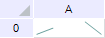
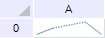

# GxSparkNullValueBehavior

GxSparkNullValueBehavior
-

# GxSparkNullValueBehavior

## Описание

Перечисление GxSparkNullValueBehavior
 содержит способы построения спарклайна при наличии пустых данных.

Используется следующими свойствами и методами:

	- [ISparkline.NullValueBehavior](../Interface/ISparkline/ISparkline.NullValueBehavior.htm).

## Допустимые значения

		 Значение
		 Краткое описание

		 0
		 Default_. Спарклайн
		 не отображает пустые данные. При наличии пустых данных график
		 будет рисоваться с разрывами.

		 1
		 DirectConnectionDotLine.
		 Спарклайн игнорирует пустые значения. При наличии пустых данных
		 отрезки графика будут соединены штриховой линией.

См. также:

[Перечисления
 сборки Drawing](ModDraving_Enums.htm)

		Справочная
		 система на версию 10.9
		 от 18/08/2025,
		 © ООО «ФОРСАЙТ»,
