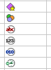

# IExporter.ExportToFile

IExporter.ExportToFile
-

# IExporter.ExportToFile

## Синтаксис

ExportToFile(FileName: String; FormatTag: String);

## Параметры

FileName. Наименование файла,
 в который будет произведен экспорт.

FormatTag. Формат файла, в
 который будет произведен экспорт. В зависимости от экспортируемого объекта,
 возможны различные форматы экспорта.

## Описание

Метод ExportToFile осуществляет
 экспорт объекта в файл указанного формата.

## Комментарии

Описание особенностей экспорта определенных типов объектов представлено
 в следующих разделах:

[IAdhocReportExporter](javascript:TextPopup(this))

## Комментарии

	Карты и диаграммы, содержащиеся в аналитической панели, экспортируются
	 в виде изображений.

	Доступны следующие форматы экспорта аналитических панелей:

		- Книга Excel (*.xls);

		- Документ PDF (*.pdf);

		- Документ в формате RTF (*.rtf);

		- Веб-страница, архив в одном файле (*.mht);

		- Файл в формате EMF (*.emf);

		- Презентация PowerPoint (*.ppxt).

## Пример

	Для выполнения примера предполагается наличие в репозитории аналитической
	 панели с идентификатором ADHOC, содержащей блок с идентификатором
	 IQY1DKCFA3U5BTQP.

	Добавьте ссылки на системные сборки: AdHoc, Metabase.

		Sub UserProc;

		Var

		    mb: IMetabase;

		    Rep: IAdhocReport;

		    Ex: IAdhocReportExporter;

		Begin

		    mb := MetabaseClass.Active;

		    // Получаем аналитическую панель

		     Rep := mb.ItemById("ADHOC").Bind As IAdhocReport;

		    // Создаем объект экспорта

		     Ex := New AdhocReportExporter.Create;

		    // Задаем экспортируемую панель

		     Ex.AdhocReport := Rep;

		    // Задаем экспортируемый блок

		     Ex.DataSources := "IQY1DKCFA3U5BTQP";

		    // Выполняем экспорт

		     Ex.ExportToFile("C:\Dashboard.xls", "XLS");

		End Sub UserProc;

	После выполнения примера блок с указанным идентификатором будет
	 экспортирован в файл «C:\Dashboard.xls».

[IWxViewExporter](javascript:TextPopup(this))

## Комментарии

	Экспорт рабочего пространства возможен в следующие форматы:

		- bmp;

		- png;

		- jpg;

		- gif;

		- tiff.

## Пример

	Для выполнения примера предполагается наличие в репозитории рабочего
	 пространства с идентификатором WORKSPACE.

	Добавьте ссылки на системные сборки: Andy, Metabase.

		Sub UserProc;

		Var

		    MB: IMetabase;

		    WS: IWxWorkspace;

		    View: IWxView;

		    Exp: IWxViewExporter;

		Begin

		    MB := MetabaseClass.Active;

		    WS := MB.ItemById("WORKSPACE").Open(Null) As IWxWorkspace;

		    View := WS.CreateView;

		    Exp := New WxViewExporter.Create;

		    Exp.WxView := View;

		    Exp.ExportToFile("C:\РП.png", "png");

		End Sub UserProc;

	После выполнения примера рабочее пространство будет экспортировано
	 в файл РП.png.

[IChartExporter](javascript:TextPopup(this))

## Комментарии

	Экспорт диаграммы возможен в следующие форматы:

		- jpg;

		- bmp;

		- png;

		- tiff;

		- gif;

		- html;

		- xaml.

## Пример

	Для выполнения примера предполагается наличие в репозитории экспресс-отчёта
	 с идентификатором EAX_REPORT.

	Добавьте ссылки на системные сборки: Chart, Express, Metabase.

		Sub UserProc;

		Var

		    MB: IMetabase;

		    Express: IEaxAnalyzer;

		    Exp: IChartExporter;

		Begin

		    MB := MetabaseClass.Active;

		    Express := MB.ItemById("EAX_REPORT").Open(Null) As IEaxAnalyzer;

		    Exp := New ChartExporter.Create;

		    Exp.Chart := Express.Chart.Chart;

		    Exp.Scale := 0.5;

		    Exp.ExportToFile("C:\Диаграмма.png", "png");

		End Sub UserProc;

	После выполнения примера диаграмма экспресс-отчёта будет экспортирована
	 в файл Диаграмма.png.

[IScene3DExporter](javascript:TextPopup(this))

## Комментарии

	Экспорт трехмерной сцены возможен в следующие форматы:

		- jpg;

		- bmp;

		- png;

		- tiff;

		- gif;

		- html.

[IExAnalyzerExporter](javascript:TextPopup(this))

## Комментарии

	Экспорт экспресс-отчёта возможен в следующие форматы:

		- mht;

		- html;

		- pdf;

		- xls;

		- xlsx;

		- rtf;

		- emf;

		- pptx.

	Примечание.
	 Если необходимо осуществить экспорт нескольких отчётов в один файл,
	 то вместе с методом ExportToFile
	 следует использовать методы [IExAnalyzerExporter.StartBatchCommand](KeExpress.chm::/Interface/IExAnalyzerExporter/IExAnalyzerExporter.StartBatchCommand.htm)
	 и [IExAnalyzerExporter.FinishBatchCommand](KeExpress.chm::/Interface/IExAnalyzerExporter/IExAnalyzerExporter.FinishBatchCommand.htm).

## Пример

	Для выполнения примера предполагается наличие в репозитории экспресс-отчёта
	 с идентификатором EAX_REPORT.

	Добавьте ссылки на системные сборки: Express, Metabase.

		Sub UserProc;

		Var

		    MB: IMetabase;

		    Express: IEaxAnalyzer;

		    Exp: IExAnalyzerExporter;

		Begin

		    MB := MetabaseClass.Active;

		    Express := MB.ItemById("EAX_REPORT").Open(Null) As IEaxAnalyzer;

		    Exp := New ExAnalyzerExporter.Create;

		    Exp.ExAnalyzer := Express;

		    Exp.ExportToFile("C:\Analazer.xls", "XLS");

		End Sub UserProc;

	После выполнения примера экспресс-отчёт будет экспортирована в файл
	 Analazer.xls.

[IPrxReportExporter](javascript:TextPopup(this))

## Комментарии

	Экспорт регламентного отчёта возможен в следующие форматы:

		- xlsx;

		- xls;

		- pdf;

		- rtf;

		- ppxt;

		- html;

		- mht;

		- ods;

		- emf;

		- png. Для корректного экспорта регламентного отчёта в формат
		 png определите [диапазон
		 экспортируемых листов](KeReport.chm::/Interface/IPrxReportExporter/IPrxReportExporter.ExportRange.htm).

	Если необходимо осуществить экспорт нескольких отчётов в один файл,
	 то вместе с методом ExportToFile
	 следует использовать методы [IExAnalyzerExporter.StartBatchCommand](KeExpress.chm::/Interface/IExAnalyzerExporter/IExAnalyzerExporter.StartBatchCommand.htm)
	 и [IExAnalyzerExporter.FinishBatchCommand](KeExpress.chm::/Interface/IExAnalyzerExporter/IExAnalyzerExporter.FinishBatchCommand.htm).

## Пример

	Для выполнения примера предполагается наличие в репозитории регламентного
	 отчёта с идентификатором REPORT.

	Добавьте ссылки на системные сборки: Metabase, Report.

		Sub UserProc;

		Var

		    MB: IMetabase;

		    Report: IPrxReport;

		    Exp: IPrxReportExporter;

		Begin

		    MB := MetabaseClass.Active;

		    Report := MB.ItemById("REPORT").Open(Null) As IPrxReport;

		    Exp := New PrxReportExporter.Create;

		    Exp.Report := Report;

		    Exp.ExportSheetTitles := True;

		    Exp.ExportRange := "1:0";

		    Exp.ExportToFile("C:\" + Report.Name + ".png", "png");

		End Sub UserProc;

	После выполнения примера регламентный отчёт будет экспортирован
	 в файл в формате PNG. В результирующем файле будут отражены наименования
	 листов.

[ITabIconExporter](javascript:TextPopup(this))

## Комментарии

	Экспорт значков таблицы возможен в следующие форматы:

		- png;

		- jpg;

		- bmp;

		- gif;

		- tiff.

## Пример

	Для выполнения примера предполагается наличие в репозитории регламентного
	 отчёта с идентификатором REPORT. На листе отчёта расположены значки,
	 например:

	

	Добавьте ссылки на системные сборки: Metabase, Report, Tab.

		Sub UserProc;

		Var

		    MB: IMetabase;

		    Report: IPrxReport;

		    Exp: ITabIconExporter;

		Begin

		    MB := MetabaseClass.Active;

		    Report := MB.ItemById("REPORT").Open(Null) As IPrxReport;

		    Exp := New TabIconExporter.Create;

		    Exp.TabSheet := (Report.ActiveSheet As IPrxTable).TabSheet;

		    Exp.IconIndex := 0;

		    Exp.ExportToFile("C:\Icon1.gif", "gif");

		End Sub UserProc;

	После выполнения примера первый значок листа будет экспортирован
	 в указанный файл.

[ITabObjectExporter](javascript:TextPopup(this))

## Комментарии

	Экспорт таблицы возможен в следующие форматы:

		- gif;

		- jpg;

		- bmp;

		- gif;

		- tiff;

		- xaml (только для диаграмм).

## Пример

	Для выполнения примера предполагается наличие в репозитории регламентного
	 отчёта с идентификатором REPORT. На листе отчёта имеется какой-либо
	 объект.

	Добавьте ссылки на системные сборки: Metabase, Report.

		Sub UserProc;

		Var

		    MB: IMetabase;

		    Report: IPrxReport;

		    Exp: ITabObjectExporter;

		    Tab: ITabSheet;

		    Obj: ITabObject;

		Begin

		    MB := MetabaseClass.Active;

		    Report := MB.ItemById("REPORT").Open(Null) As IPrxReport;

		    Tab := (Report.Sheets.Item(0) As IPrxTable).TabSheet;

		    Obj := Tab.Objects.Item(0);

		    Exp := New TabObjectExporter.Create;

		    Exp.Object := Obj;

		    Exp.ExportToFile("C:\Object.png", "png");

		End Sub UserProc;

	После выполнения примера объект листа отчёта будет экспортирован
	 в файл указанный файл.

[ITabSheetExporter](javascript:TextPopup(this))

## Комментарии

	Экспорт листа регламентного отчёта возможен в следующие форматы:

		- html;

		- mht;

		- pdf;

		- xls;

		- xlsx;

		- rtf;

		- ods;

		- emf;

		- pptx.

## Пример

	Для выполнения примера предполагается наличие в репозитории регламентного
	 отчёта с идентификатором REPORT.

	Добавьте ссылки на системные сборки: Metabase, Report, Tab.

		Sub UserProc;

		Var

		    MB: IMetabase;

		    Report: IPrxReport;

		    Tab: ITabSheet;

		    Exp: ITabSheetExporter;

		Begin

		    MB := MetabaseClass.Active;

		    Report := MB.ItemById("REPORT").Open(Null) As IPrxReport;

		    Tab := (Report.ActiveSheet As IPrxTable).TabSheet;

		    Exp := New TabSheetExporter.Create;

		    Exp.TabSheet := Tab;

		    Exp.ExportObjects := False;

		    Exp.ExportToFile("c:\Sheet.xls", "XLS");

		End Sub UserProc;

	После выполнения примера активный лист регламентного отчёта будет
	 экспортирован в файл формата "XLS". Объекты, содержащиеся
	 на листе таблицы, экспортированы не будут.

См. также:

[IExporter](IExporter.htm)

		Справочная
		 система на версию 10.9
		 от 18/08/2025,
		 © ООО «ФОРСАЙТ»,
