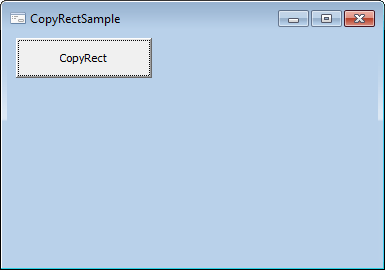
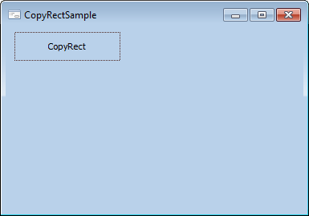

# IGxImage.CopyRect

IGxImage.CopyRect
-

# IGxImage.CopyRect

## Синтаксис

CopyRect(Rect: [IGxRect](../IGxRect/IGxRect.htm)):
 [IGxImage](IGxImage.htm);

## Параметры

Rect - прямоугольник, ограничивающий
 часть текущего изображения, которую необходимо получить.

## Описание

Метод CopyRect возвращает часть
 текущего изображения, ограниченную прямоугольником, передаваемым посредством
 параметра Rect.

## Комментарии

Данный метод возвращает часть изображения, расположенную в указанной
 прямоугольной области. Размер прямоугольника, передаваемого в параметре
 Rect, должен быть не больше размеров
 текущего изображения.

## Пример

Для выполнения примера предполагается наличие формы, расположенной на
 ней кнопки ImageButton с наименованием
 «ImageButton1» и компонента ImageBox
 с наименованием «ImageBox1». Компонент «ImageBox1» занимает всю клиентскую
 область формы, создавая фон формы. В данный компонент загружено какое-либо
 изображение.

			Sub ImageButton1OnClick(Sender: Object; Args: IMouseEventArgs);

Var

    r: IGxRect;

    Img: IGxImage;

Begin

    r := New GxRect.Create(ImageButton1.Left,

        ImageButton1.Top,

        ImageButton1.Left + ImageButton1.Width,

        ImageButton1.Top + ImageButton1.Height);

    Img := ImageBox1.GetImage;

    Img := Img.CopyRect(r);

    ImageButton1.NormalLook.Background := Img;

End Sub ImageButton1OnClick;

После запуска форма может иметь примерно следующий вид:

При нажатии на кнопку в качестве фона в обычном состоянии для нее будет
 установлена та часть изображения, которую кнопка занимает над компонентом
 «ImageBox1». За счет этого будет достигнут эффект прозрачности кнопки:

См. также:

[IGxImage](IGxImage.htm)

		Справочная
		 система на версию 10.9
		 от 18/08/2025,
		 © ООО «ФОРСАЙТ»,
