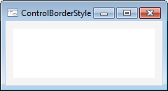
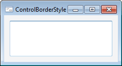
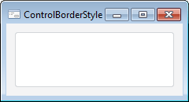

# ControlBorderStyle

ControlBorderStyle
-

# ControlBorderStyle

## Описание

Перечисление ControlBorderStyle
 содержит стили границы различных компонентов.

## Допустимые значения

		 Значение

		 Краткое
		 описание

		 0

		 None. Компонент
		 не имеет рамки.

		

		 1

		 Single. Компонент
		 имеет объемный вид.

		

		 2

		 Flat. Компонент
		 имеет рамку, толщиной в один пиксель.

		

См. также:

[Перечисления сборки Forms](ModForms_Enums.htm)

		Справочная
		 система на версию 10.9
		 от 18/08/2025,
		 © ООО «ФОРСАЙТ»,
