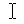
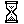
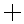
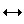
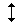

# ControlCursor

ControlCursor
-

# ControlCursor

## Описание

Перечисление ControlCursor содержит виды курсора, отображаемого при наведении курсора мыши на компонент.

Используется следующим свойством:

-
[IControl.Cursor](../Interface/IControl/IControl.Cursor.htm)

## Допустимые значения

Значение

Краткое описание

-1

Default_. Курсор, установленный для компонента по умолчанию.

32512

Arrow. Основной режим.

32513

IBeam. Выделение текста.

32514

Wait. Система недоступна.

32515

Cross. Графическое выделение.

32516

UpArrow. Специальное выделение.

32642

SizeNWSE. Изменение размеров по диагонали 1.

32643

SizeNESW. Изменение размеров по диагонали 2.

32644

SizeWE. Изменение горизонтальных размеров.

32645

SizeNS. Изменение вертикальных размеров.

32646

SizeAll. Перемещение.

32648

SizeNo. Операция невозможна.

32649

Hand. Выбор ссылки.

32650

AppStarting. Фоновый режим.

32651

Help. Выбор справки.

См. также:

[Перечисления сборки Forms](ModForms_Enums.htm)

		Справочная
		 система на версию 10.9
		 от 18/08/2025,
		 © ООО «ФОРСАЙТ»,
