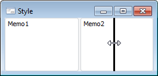
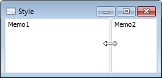
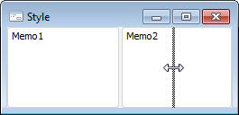

# ResizeStyle

ResizeStyle
-

# ResizeStyle

## Описание

Перечисление ResizeStyle содержит
 стили, которые принимает компонент [Splitter](UiDevEnv.chm::/02_Components_constructor_forms/01_Standart_Components/Splitter.htm)
 при изменении размеров связанных компонентов.

Используется следующим свойством:

	- [ISplitter.Style](../Interface/ISplitter/ISplitter.Style.htm)

## Допустимые значения

		 Значение
		 Краткое описание

		 0
		 None. При изменении
		 размеров связанных компонентов компонент [Splitter](UiDevEnv.chm::/02_Components_constructor_forms/01_Standart_Components/Splitter.htm)
		 не отображается.

		 1
		 Line. При изменении
		 размеров связанных компонентов компонент отображается в виде линии.

		 2
		 Update. При изменении
		 размеров связанных компонентов происходит автоматическое обновление
		 границ компонентов.

		 3
		 Pattern. При изменении
		 размеров связанных компонентов компонент отображается в виде линии
		 с точечной заливкой.

См. также:

[Перечисления сборки Forms](ModForms_Enums.htm)

		Справочная
		 система на версию 10.9
		 от 18/08/2025,
		 © ООО «ФОРСАЙТ»,
