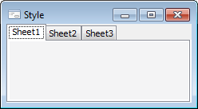
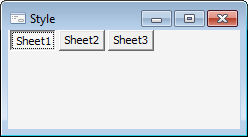
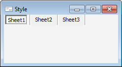

# TabStyle

TabStyle
-

# TabStyle

## Описание

Перечисление TabStyle содержит
 стили вкладок страниц компонента [PageControl](UiDevEnv.chm::/02_Components_constructor_forms/02_Additional_components/PageControl.htm).

Используется следующим свойством:

	- [IPageControl.Style](../Interface/IPageControl/IPageControl.Style.htm).

## Допустимые значения

		 Значение
		 Краткое описание

		 0
		 Tab. Обычные корешки.

		 1
		 Buttons. Кнопки.

		 2
		 FlatButtons. Плоские
		 кнопки.

См. также:

[Перечисления сборки Forms](ModForms_Enums.htm)

		Справочная
		 система на версию 10.9
		 от 18/08/2025,
		 © ООО «ФОРСАЙТ»,
