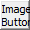
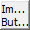
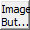
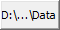

# TextTrimming

TextTrimming
-

# TextTrimming

## Описание

Перечисление TextTrimming содержит
 режимы отсечения текста, если текст не помещается в область компонента.

Используется следующим свойством:

	- [IImageButton.Trimming](../Interface/IImageButton/IImageButton.Trimming.htm).

## Допустимые значения

		 Значение
		 Краткое описание

		 0
		 None. Отсекать любое
		 слово, которое не помещается в область компонента.

		 1
		 WordEllipsis. Отсекать
		 любое слово, которое не помещается в область компонента, и добавлять
		 после него символ «…».

		 2
		 EndEllipsis. Отсекать
		 любое слово, которое не помещается в область компонента. Для последнего
		 слова добавляется символ «…».

		 3
		 PathEllipsis. Отсекать
		 любое слово, которое не помещается в область компонента. Если
		 в строке содержатся символы обратной косой черты (\), то отображается
		 максимально возможный текст после последней обратной косой черты.
		 Для этого текст внутри строки заменяется символом «…».

См. также:

[Перечисления сборки Forms](ModForms_Enums.htm)

		Справочная
		 система на версию 10.9
		 от 18/08/2025,
		 © ООО «ФОРСАЙТ»,
