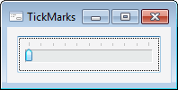
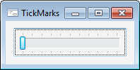

# TrackBarTickMark

TrackBarTickMark
-

# TrackBarTickMark

## Описание

Перечисление TrackBarTickMark
 содержит способы нанесения меток.

Используется следующим свойством:

	- [ITrackBar.TickMarks](../Interface/ITrackBar/ITrackBar.TickMarks.htm)

## Допустимые значения

		 Значение
		 Краткое описание

		 0
		 BottomRight. Метки
		 наносятся внизу или справа (в зависимости от ориентации компонента).

		 1
		 TopLeft. Метки наносятся
		 вверху или слева (в зависимости от ориентации компонента).

		 2
		 Both. Метки наносятся
		 по обеим сторонам.

См. также:

[Перечисления сборки Forms](ModForms_Enums.htm)

		Справочная
		 система на версию 10.9
		 от 18/08/2025,
		 © ООО «ФОРСАЙТ»,
