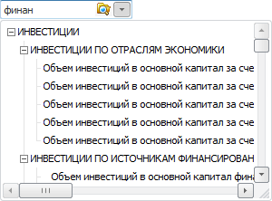
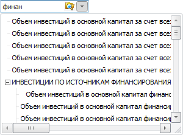
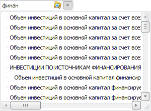

# TreeComboFilterStyle

TreeComboFilterStyle
-

# TreeComboFilterStyle

## Описание

Перечисление TreeComboFilterStyle
 содержит режимы построения дерева отфильтрованных элементов.

Используется следующими свойствами и методами:

	- [ITreeCombo.FilterStyle](../Interface/ITreeCombo/ITreeCombo.FilterStyle.htm);

	- [ITreeList.FilterStyle](../Interface/ITreeList/ITreeList.FilterStyle.htm);

	- [IDimensionCombo.FilterStyle](KeExtCtrls.chm::/Interface/IDimensionCombo/IDimensionCombo.FilterStyle.htm).

## Допустимые значения

		 Значение
		 Краткое описание

		 1
		 ShowAllParents. В дереве
		 отображаются найденные элементы со всеми родительскими элементами.

		 2
		 ShowNearestParent.
		 В дереве отображаются найденные элементы с ближайшим родительским
		 элементом, содержащим искомый текст.

		 3
		 PlainList. Формируется
		 одноуровневый список из найденных элементов.

См. также:

[Перечисления сборки Forms](ModForms_Enums.htm)

		Справочная
		 система на версию 10.9
		 от 18/08/2025,
		 © ООО «ФОРСАЙТ»,
